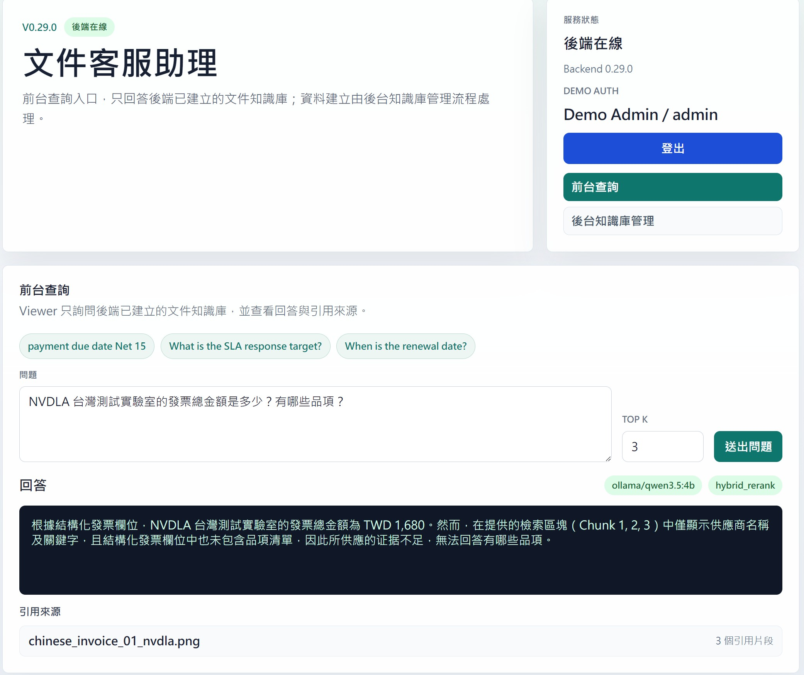
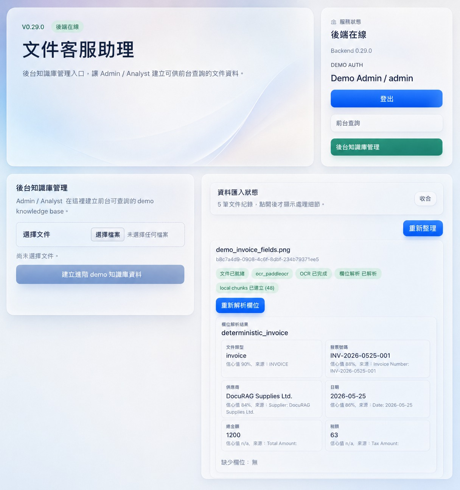

# DocuRAG

> 開發紀錄、ticket 進度、版本更新日誌與本地開發備忘請見：[README_DEV.md](./README_DEV.md)

文件知識庫問答與後台管理。

DocuRAG 是技術探索導向的 AI 文件知識庫專案，將文件上傳、OCR / VLM 解析、hybrid RAG、引用來源、RAG 評估與 Agent tool-use 串成可本機驗證的實驗流程。主線聚焦「前台查詢、後台建庫」：Viewer 詢問已建立的知識庫，Admin / Analyst 建立文件資料並查看解析細節。

## 畫面預覽





## 功能

- 前台知識庫問答
- 回答引用來源
- 後台文件匯入
- PaddleOCR 優先 OCR
- VLM-first 欄位解析
- Hybrid rerank 檢索
- 內建 RAG 測試
- Agent tool-use trace

## 需求

- Python 3.12
- Node.js 18+
- 本機可選 Ollama
- 本機可選 Qdrant
- 本機可選 PaddleOCR GPU

## 快速啟動

Backend：

```bat
cd /d C:\Users\USER\Desktop\DocuRAG\backend
python -m pip install -e ".[dev]"
python -m uvicorn app.main:app --reload
```

Frontend：

```bat
cd /d C:\Users\USER\Desktop\DocuRAG\frontend
npm.cmd install
set "VITE_API_BASE_URL=http://127.0.0.1:8000"
npm.cmd run dev
```

Web UI：

```text
http://localhost:5173
```

API docs：

```text
http://127.0.0.1:8000/docs
```

## 使用方式

1. 用 Admin 登入後台。
2. 上傳文件或圖片。
3. 執行 OCR 與欄位解析。
4. 建立可查詢知識庫。
5. 回到前台送出問題。
6. 查看回答與引用來源。

本機測試帳號：

```text
admin / demo-admin-pass
analyst / demo-analyst-pass
viewer / demo-viewer-pass
```

若未啟用 `DOCURAG_AUTH_MODE=demo`，系統會以無登入的本機模式啟動。

## 技術棧

- Frontend：Vue 3、Vite、TypeScript
- Backend：FastAPI、Pydantic、pytest
- OCR / VLM：PaddleOCR、Ollama-compatible VLM
- RAG：Ollama embedding、Qdrant、FastEmbed reranker
- Storage：本機 JSON metadata 與 uploaded files
- Workflow：ticket-first 小步開發

## API 串接

- `GET /health`：檢查服務版本與狀態。
- `POST /documents/upload`：上傳文件。
- `POST /documents/{document_id}/ocr`：執行 OCR。
- `POST /documents/{document_id}/parse`：解析欄位。
- `POST /documents/{document_id}/index/vector`：建立向量索引。
- `POST /rag/query`：送出知識庫問題。
- `POST /eval/rag/built-in`：執行內建 RAG 測試。
- `POST /agent/run`：執行 read-only Agent task。

## 開發與驗證

Backend tests：

```powershell
powershell -NoProfile -ExecutionPolicy Bypass -File .\scripts\test-backend.ps1
```

Smoke test：

```powershell
powershell -NoProfile -ExecutionPolicy Bypass -File .\scripts\demo-smoke-test.ps1
```

Retrieval eval：

```powershell
powershell -NoProfile -ExecutionPolicy Bypass -File .\scripts\retrieval-eval-smoke.ps1
```

完整進階設定、release log 與本地驗證紀錄請看 [README_DEV.md](./README_DEV.md)。

## 目前邊界

目前是技術探索用 MVP，不宣稱已完成 production 系統。尚未包含正式 RBAC、tenant isolation、PostgreSQL schema、Redis、NATS、worker、scanned PDF OCR pipeline、K8s hardening、自訂 eval dashboard 或 production autonomous Agent。

## 文件入口

- [README_DEV.md](./README_DEV.md)：完整開發紀錄、release log、ticket 進度與本地開發備忘。
- [docs/PRD.md](./docs/PRD.md)：MVP 產品需求。
- [docs/architecture.md](./docs/architecture.md)：目前架構與延後項目。
- [docs/ROADMAP.md](./docs/ROADMAP.md)：phase / milestone 路線圖。
- [docs/demo-script.md](./docs/demo-script.md)：本機操作流程筆記。
- [docs/api.md](./docs/api.md)：API contract 補充。
- [tasks/](./tasks/)：ticket-first 開發任務票。
