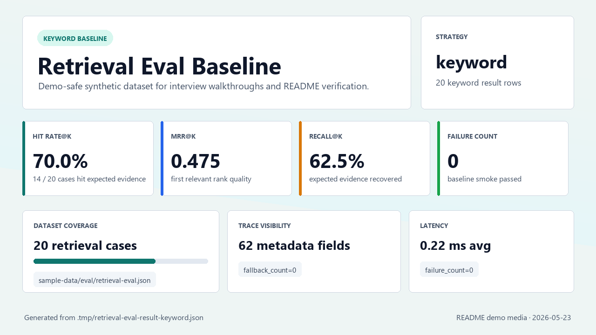

# DocuRAG AgentOps

DocuRAG AgentOps 是一個面試展示用的 AI 文件平台 side project，用來呈現企業級文件上傳、OCR、local RAG、citation trace 與 AgentOps 產品思維。

目前主線已完成 local document workflow、provider-selected PaddleOCR OCR flow、PP-OCRv4 mobile 中文 / 中英混合模型設定、backend startup preload、provider reuse、OCR timing metadata、mock OCR override、local keyword RAG baseline、可選 Ollama Qwen3.5 RAG generation demo、可選 manual vector indexing + Qdrant vector retrieval demo、retrieval evaluation baseline、disabled-by-default vector rerank eval spike、optional hybrid retrieval eval strategy、real GPU OCR-first backend ingestion path、Viewer Chat / Admin Ingestion role split，以及可重跑的本機 backend validation。這仍是受控 MVP，不是 production OCR / RAG 平台。

## Project Goal

DocuRAG AgentOps 要展示三件事：

- 文件智能平台的產品流程：後台上傳文件後可保存 metadata、執行 OCR、產生 chunks，前台則用客服式 RAG chat 查詢已建置的知識庫。
- RAG 工程能力：回答問題時保留 citations、retrieved chunks 與 trace metadata。
- 可維護的 AI application 架構：backend、frontend、docs、tasks、infra 與 sample data 的責任邊界清楚。

## Current Scope

目前最新主線包含：

- FastAPI backend，提供 healthcheck、文件上傳、文件列表、文件詳情、OCR result 與 RAG query API。
- Local JSON metadata store，保存 document metadata、OCR result、chunks、processing status 與 processing job metadata。
- Provider-selected OCR endpoint：`POST /documents/{document_id}/ocr` 預設走 PaddleOCR。
- Mock OCR override：`POST /documents/{document_id}/ocr/mock` 可在沒有 real OCR runtime 時重跑 demo-safe flow。
- OCR line normalization，將 OCR text、page、bbox、confidence 與 metadata 映射到 chunks 與 citations。
- PaddleOCR 預設固定 `lang=ch`、`ocr_version=PP-OCRv4`、`PP-OCRv4_mobile_det` / `PP-OCRv4_mobile_rec`，並保留 model dir env override。
- Backend startup 會在 selected provider 為 PaddleOCR 時 preload engine；provider-selected OCR request 會重用同一個 provider / engine。
- PaddleOCR result metadata 會輸出 safe timing 欄位：engine preload / request load / inference / normalization / total duration。
- v0.9.1 預設 `DOCURAG_OCR_USE_ANGLE_CLS=false`、`DOCURAG_OCR_DET_LIMIT_SIDE_LEN=960`、`DOCURAG_OCR_REC_BATCH_NUM=6`；mock OCR path 不受影響。
- Local keyword RAG baseline，回傳 deterministic answer、citations 與 retrieved chunks。
- v0.10.0 已固定 LLM / VLM 第一版目標為 Ollama `qwen3.5:4b`，並新增最小 Ollama LLM client、可選 `/rag/query` generation path、demo smoke `-RunLlm` 與 frontend answer source；20-12 local demo follow-up 起，未覆寫時預設嘗試 Ollama `qwen3.5:4b` generation，Ollama 不可用時回到 retrieved OCR chunks fallback，若要 deterministic baseline 可設定 `DOCURAG_LLM_PROVIDER=`。
- v0.11.0 已新增 disabled-by-default Ollama embedding client、optional Qdrant local runtime / collection smoke 與 fallback-safe vector retrieval path。
- v0.12.0 已新增 manual vector indexing service / API；只有明確呼叫 `POST /documents/{document_id}/index/vector` 後，vector retrieval demo 才會查詢已索引到 Qdrant 的 chunks，失敗會回到 keyword baseline。
- v0.13.0 已新增公開 retrieval eval dataset、本機 evaluation runner、Hit Rate@K / MRR@K / Recall@K / latency / failure count metrics，以及 baseline / optional vector eval smoke。
- v0.15.0 已新增 disabled-by-default FastEmbed rerank adapter building block、optional `vector_rerank` eval strategy、rerank trace metadata 與 `-RunVectorRerank` smoke flag；未啟用 rerank provider 時會保留 vector candidates 並記錄 fallback reason。
- v0.16.0 已將公開 retrieval eval dataset 擴充到 12 筆，新增 optional `hybrid` eval strategy 與 `-RunHybrid` smoke flag；`hybrid` 只用於 eval runner，不接 `/rag/query` 或 frontend UI。
- v0.17.0 已新增 frontend compact retrieval trace panel，並改善 retrieval eval summary visibility；UI 只讀既有 RAG response metadata，eval summary 顯示 fallback count、trace metadata count 與 result strategy counts，不新增 backend API 或 production eval dashboard。
- v0.18.0 已完成 `hybrid_rerank` planning backlog；這是 Markdown-only planning，不代表 runtime、eval runner、frontend UI 或 smoke flag 已可用。
- v0.19.0 已完成 optional `hybrid_rerank` eval strategy：eval provider、`-RunHybridRerank` smoke flag、trace / report metadata naming 與 release sync；這仍只屬於 retrieval eval runner，不接 default `/rag/query` 或 frontend chat。
- v0.20.0 已完成 interview MVP packaging：demo script、sample / eval coverage、README demo media、baseline validation 與 release 文件同步；不新增 production eval dashboard、worker、DB、auth 或 deployment。
- v0.21.0 已將 frontend 文件上傳主線改為 provider-selected real GPU OCR-first；失敗時才顯示手動 mock OCR fallback，不再靜默使用 mock OCR。
- v0.22.0 已強化 default keyword RAG query normalization：中文查詢與常見 demo alias 可命中既有英文 OCR chunks，例如「付款期限是什麼？」可命中 `Payment terms: Net 15`；這不是 default-on vector、hybrid 或 rerank。
- v0.23.0 已完成 Viewer Chat / Admin Ingestion role split：前台 Viewer 只查詢已建立知識庫，後台 Admin / Analyst 才執行 upload、provider-selected OCR 與 ingestion 狀態檢查；這不是 auth / RBAC 或 production indexing。
- v0.24.0 已完成 VLM / Parser Minimal MVP：新增 VLM-compatible parser contract、deterministic invoice parser fallback、`POST /documents/{document_id}/parse`、`GET /documents/{document_id}/fields`、local JSON parser result persistence、frontend structured fields surface 與 parser demo smoke；這不是 production VLM parser、LLM parser、worker、DB 或 Agent runtime。
- v0.25.0 backlog 已新增 Agent Tool-use Minimal MVP：下一步會以 deterministic planner + allowlisted tools 串接 structured fields、document search 與 deterministic invoice summary；這不是 production autonomous Agent、LLM planner、權限系統或任意 tool execution。
- Vue 3 + Vite frontend 目前仍是受控 demo surface；Phase 23 起產品邊界固定為 Viewer Chat 與 Admin / Analyst Ingestion 兩個入口：Viewer 前台只查詢已建立知識庫，文件上傳與 OCR 屬於後台知識庫管理流程。OCR detail、document list、raw JSON 與 detailed trace table 可透過 backend API / CLI / smoke scripts 檢查；正式知識庫 ingestion / indexing pipeline 尚未實作。
- Python 3.12 backend runtime；real OCR 只支援 PaddlePaddle GPU / CUDA runtime，dependency 收斂在 `backend[real-ocr]` optional extra。
- Dockerfile / Docker Compose backend runtime，real OCR GPU dependency 可透過 build arg 開啟。

目前仍刻意不實作：

- PDF rendering、image preprocessing、版面分析、多頁文件處理或 OCR accuracy tuning。
- Production-grade VLM parser、真正 vision model 欄位抽取、人工修正欄位版本紀錄或表格完整重建。
- Default-on vector retrieval、default-on rerank、default-on hybrid retrieval、default-on `hybrid_rerank` chat path、LLM-as-judge、answer faithfulness scoring、eval dashboard、streaming UI、OpenAI API 或 vLLM serving。
- Production autonomous Agent、LLM planner、任意 SQL / tool execution、Agent permission model 或 destructive tools。
- Redis、NATS、async worker、queue、PostgreSQL、資料庫 schema、登入、權限或 RBAC。
- Production-grade K8s deployment。

## Interview Demo Path

5 到 10 分鐘面試導覽建議：

1. Demo 前先用 `scripts/seed-demo-data.ps1` 或 backend API 預載公開 synthetic sample，讓前台像客服機器人一樣直接提問。
2. 第一屏用 `payment due date Net 15` 詢問 RAG，展示 answer source、retrieval source 與簡化引用來源。
3. 說明產品入口拆分：前台 Viewer Chat 只查詢已建立知識庫；文件上傳與 OCR 是 Admin / Analyst 的後台 ingestion flow，實際 OCR、metadata、chunks 與 detailed trace 由 backend / CLI 層檢查；正式知識庫 ingestion / indexing pipeline 尚未實作。
4. 若面試官想看工程細節，再切到 API docs、smoke script output 或 eval CLI 說明 strategy、fallback state 與 trace metadata。
5. 切到 retrieval eval smoke summary，說明 `case_count=20`、Hit Rate@K、MRR@K、Recall@K、failure count 與 trace metadata count。
6. 補充 optional paths：`vector`、`vector_rerank`、`hybrid` 與 `hybrid_rerank` 都是 explicit eval / demo path；`hybrid_rerank` 不接 default `/rag/query` 或 frontend chat route。

## Recommended Viewer Chat / Admin Ingestion Demo

這是 Phase 23 的產品邊界：Viewer 前台只負責 Chat 查詢既有知識庫；Admin / Analyst 後台才操作文件上傳與 ingestion。現有 backend upload 後可呼叫 provider-selected real GPU OCR；若 GPU OCR runtime 不可用，後台 ingestion flow 可保留已上傳文件並使用手動 mock OCR fallback。mock 不再是上傳主線，也不是 Viewer Chat 體驗的一部分。

1. 啟動 real GPU OCR backend：

```powershell
cd backend
py -3.12 -m pip install "paddlepaddle-gpu==3.3.0" -i https://www.paddlepaddle.org.cn/packages/stable/cu129/
py -3.12 -m pip install -e ".[dev,real-ocr]"
$env:DOCURAG_OCR_PROVIDER="paddleocr"
py -3.12 -m uvicorn app.main:app --reload
```

2. 另開 terminal 啟動 frontend：

```powershell
cd frontend
npm.cmd install
npm.cmd run dev
```

3. 回到 repo root，可先預載客服 chat 的 demo knowledge base；若要同時驗證 real OCR sample，加上 `-RunRealOcr`：

```powershell
powershell -NoProfile -ExecutionPolicy Bypass -File .\scripts\seed-demo-data.ps1
powershell -NoProfile -ExecutionPolicy Bypass -File .\scripts\seed-demo-data.ps1 -RunRealOcr
```

4. 打開 frontend，先展示 Viewer Chat 查詢既有 demo knowledge base；再切到 Admin / Analyst ingestion surface 或 backend API / CLI，使用 `sample-data/documents/sample-ocr-invoice.png` 驗證 GPU OCR-first upload flow：

```text
http://localhost:5173
payment due date Net 15
```

5. 展示回答與簡化引用來源：

- `answer source`：預設會嘗試 `ollama/qwen3.5:4b`；Ollama 不可用時是 `LLM unavailable fallback`；若以 `DOCURAG_LLM_PROVIDER=` 明確關閉則是 deterministic baseline。
- `retrieval source`：未啟用 vector 時是 keyword baseline。
- `引用來源`：回答對應的來源文件與引用片段數。
- detailed trace / retrieved chunks：由 backend response、smoke script 或 eval CLI 檢查，不在 frontend 主畫面攤開。

Frontend / backend demo 分工：

| 區域 | 面試說法 |
|---|---|
| 前台 Viewer Chat | Viewer 只需要詢問已建立的知識庫，並查看回答、answer source、retrieval source 與簡化引用來源。 |
| 後台 Admin / Analyst Ingestion | Admin / Analyst 可以把文件送到 backend upload + provider-selected GPU OCR flow，檢查 OCR / local chunks / metadata 狀態；正式 parser、worker、DB 與 production indexing pipeline 尚未實作。 |
| Retrieval eval smoke | 開發者用 CLI 量化 Hit Rate@K、MRR@K、Recall@K、failure count 與 trace metadata count。 |

若要展示 LLM generation、vector retrieval、rerank 或 hybrid，再切到下方 optional paths；CLI smoke 的 mock-safe baseline 仍可在無 GPU 環境驗證 API，但 frontend 上傳主線是 real OCR-first。

工程細節 demo media：



## Local Run

使用 Python 3.12 啟動 backend：

```powershell
cd backend
py -3.12 -m pip install "paddlepaddle-gpu==3.3.0" -i https://www.paddlepaddle.org.cn/packages/stable/cu129/
py -3.12 -m pip install -e ".[dev,real-ocr]"
py -3.12 -m uvicorn app.main:app --reload
```

Backend API：

```text
http://127.0.0.1:8000
http://127.0.0.1:8000/docs
```

Ollama RAG generation 預設會在 backend 啟動時嘗試使用 `DOCURAG_LLM_PROVIDER=ollama`；若要確認完整 LLM demo，先啟動 Ollama 並確認 `qwen3.5:4b` 在本機模型清單中，再用下列 env 明確啟動 backend。若要關閉 LLM generation，將 `DOCURAG_LLM_PROVIDER` 設為空字串。

```powershell
$env:DOCURAG_LLM_PROVIDER="ollama"
$env:DOCURAG_LLM_BASE_URL="http://127.0.0.1:11434"
$env:DOCURAG_LLM_MODEL="qwen3.5:4b"
py -3.12 -m uvicorn app.main:app --reload
```

回到 repo root 後可執行 baseline smoke 與 LLM smoke：

```powershell
powershell -NoProfile -ExecutionPolicy Bypass -File .\scripts\demo-smoke-test.ps1
powershell -NoProfile -ExecutionPolicy Bypass -File .\scripts\demo-smoke-test.ps1 -RunLlm
```

可選 Ollama embedding / Qdrant collection smoke：

```powershell
powershell -NoProfile -ExecutionPolicy Bypass -File .\scripts\ollama-embedding-smoke.ps1
docker-compose -f infra/docker-compose.yml up -d qdrant
powershell -NoProfile -ExecutionPolicy Bypass -File .\scripts\qdrant-collection-smoke.ps1
docker-compose -f infra/docker-compose.yml down
```

`qwen3-embedding:0.6b` 需先透過 Ollama pull；`docurag_chunks_v1` 預設 vector size 為 `1024`，對應 `Qwen3-Embedding-0.6B` model card 的 embedding dimension。未設定 vector retrieval env 時 `/rag/query` 仍走 keyword baseline。

可選 Vector RAG demo 需要同時啟動 Ollama embedding model 與 Qdrant，再用 vector env 啟動 backend；`-RunVector` smoke 會在 OCR mock 後先呼叫 manual indexing API，再執行 vector retrieval query：

```powershell
$env:DOCURAG_RAG_RETRIEVAL_PROVIDER="vector"
$env:DOCURAG_EMBEDDING_PROVIDER="ollama"
$env:DOCURAG_EMBEDDING_MODEL="qwen3-embedding:0.6b"
$env:DOCURAG_QDRANT_URL="http://127.0.0.1:6333"
$env:DOCURAG_QDRANT_COLLECTION="docurag_chunks_v1"
py -3.12 -m uvicorn app.main:app --reload
```

```powershell
powershell -NoProfile -ExecutionPolicy Bypass -File .\scripts\demo-smoke-test.ps1 -RunVector
```

Retrieval evaluation baseline 可在沒有 Ollama embedding 或 Qdrant 時直接跑 keyword metrics；輸出 JSON 預設寫到 `.tmp/retrieval-eval-result-keyword.json`：

```powershell
powershell -NoProfile -ExecutionPolicy Bypass -File .\scripts\retrieval-eval-smoke.ps1
```

Optional vector eval 需要先啟動 Ollama embedding model、Qdrant collection，並用上方 vector env 啟動 backend。`-RunVector` 會先透過 manual vector indexing API 做 preflight，再輸出 vector metrics 到 `.tmp/retrieval-eval-result-vector.json`：

```powershell
powershell -NoProfile -ExecutionPolicy Bypass -File .\scripts\retrieval-eval-smoke.ps1 -RunVector
```

Optional `vector_rerank` eval 需要同樣的 Ollama embedding、Qdrant collection 與 vector-enabled backend，並可設定 disabled-by-default rerank env。若 FastEmbed rerank runtime 尚未安裝，eval 會保留 vector candidates 並在 chunk metadata 記錄 rerank fallback；若 runtime 可用，會輸出 rerank scores 與 trace metadata 到 `.tmp/retrieval-eval-result-vector-rerank.json`：

```powershell
powershell -NoProfile -ExecutionPolicy Bypass -File .\scripts\retrieval-eval-smoke.ps1 -RunVectorRerank
```

Optional `hybrid` eval 需要同樣的 Ollama embedding、Qdrant collection 與 vector-enabled backend。`hybrid` 只接入 retrieval eval runner，會 merge / dedupe keyword 與 vector candidates，輸出 hybrid trace metadata 到 `.tmp/retrieval-eval-result-hybrid.json`；這不代表 `/rag/query` 或 frontend UI 已支援 hybrid。

```powershell
powershell -NoProfile -ExecutionPolicy Bypass -File .\scripts\retrieval-eval-smoke.ps1 -RunHybrid
```

Optional `hybrid_rerank` eval 也只屬於 retrieval eval runner。它先輸出 hybrid candidates，再交給 optional reranker 重新排序；JSON metadata 會區分 `keyword_score`、`vector_score`、`merged_score`、`rerank_score`、`final_score_source`、`fallback_count` 與 `trace_metadata_count`。

```powershell
powershell -NoProfile -ExecutionPolicy Bypass -File .\scripts\retrieval-eval-smoke.ps1 -RunHybridRerank
```

使用 Node.js / npm 啟動 frontend：

```powershell
cd frontend
npm.cmd install
npm.cmd run dev
```

Frontend UI：

```text
http://localhost:5173
```

## Dockerfile Build

建置 backend image：

```powershell
docker build -t docurag-backend ./backend
```

建置包含 real OCR GPU dependency 的 backend image：

```powershell
docker build --build-arg DOCURAG_INSTALL_REAL_OCR=true -t docurag-backend-real-ocr ./backend
```

使用 Docker Compose 啟動 backend：

```powershell
docker compose -f infra/docker-compose.yml up -d --build
curl http://127.0.0.1:8000/health
docker compose -f infra/docker-compose.yml down
```

若本機只有 standalone `docker-compose` CLI，可把上方 `docker compose` 改成 `docker-compose`。Compose 內也包含 optional Qdrant service；backend 沒有 `depends_on` Qdrant，因此 Qdrant 不可用不會阻塞既有 backend demo。

Compose real OCR runtime：

```powershell
$env:DOCURAG_INSTALL_REAL_OCR="true"
$env:DOCURAG_OCR_PROVIDER="paddleocr"
docker compose -f infra/docker-compose.yml up -d --build
curl http://127.0.0.1:8000/health
docker compose -f infra/docker-compose.yml down
```

## Repository Structure

```text
DocuRAG/
├── README.md
├── AGENTS.md
├── TODO.md
├── goal.md
├── .env.example
├── backend/
│   ├── app/
│   │   ├── api/
│   │   ├── core/
│   │   ├── repositories/
│   │   ├── schemas/
│   │   └── services/
│   ├── tests/
│   ├── Dockerfile
│   ├── pyproject.toml
│   └── README.md
├── frontend/
│   ├── src/
│   │   ├── api/
│   │   ├── App.vue
│   │   ├── main.ts
│   │   └── styles.css
│   ├── .env.example
│   ├── package.json
│   ├── package-lock.json
│   ├── vite.config.ts
│   └── README.md
├── infra/
│   └── docker-compose.yml
├── scripts/
│   ├── check-dev-env.ps1
│   ├── demo-smoke-test.ps1
│   ├── retrieval-eval-smoke.ps1
│   ├── seed-demo-data.ps1
│   └── test-backend.ps1
├── sample-data/
│   ├── documents/
│   │   ├── README.md
│   │   ├── mock-contract-support.txt
│   │   ├── mock-invoice-aurora.txt
│   │   ├── sample-ocr-invoice.png
│   │   └── sample-ocr-zh-tw.png
│   └── eval/
│       ├── README.md
│       └── retrieval-eval.json
├── docs/
│   ├── PRD.md
│   ├── ROADMAP.md
│   ├── LOCAL_DEV_SETUP.md
│   ├── api.md
│   ├── architecture.md
│   ├── db-schema.md
│   └── demo-script.md
└── tasks/
    ├── _TEMPLATE.md
    └── ...
```

Runtime data 會寫入 `data/`，包含 uploads 與 local metadata。這些內容是本機執行產物，不是主要文件結構的一部分。

## Documentation

- `goal.md`：完整產品構想與長期目標。
- `docs/PRD.md`：MVP 產品需求。
- `docs/architecture.md`：目前架構與延後項目。
- `docs/ROADMAP.md`：開發路線與 milestone。
- `docs/LOCAL_DEV_SETUP.md`：本機環境、Python 3.12、PaddleOCR 與 Docker 驗證補充。
- `docs/api.md`：API contract 補充。
- `backend/README.md`：backend 啟動、API、OCR provider 與 RAG 說明。
- `frontend/README.md`：frontend 啟動與 UI 行為說明。
- `tasks/`：ticket-first 開發任務票。

## Development Direction

本專案採用 ticket-first 工作流：

1. 每次只處理一張 `tasks/` 底下的小 ticket。
2. 實作前先讀 ticket 的 Goal、Scope、Out of Scope、Acceptance Criteria 與 Validation。
3. 每個 Phase 都要對應明確版本號；Phase 08 對應 `v0.8.0`、Phase 09 對應 `v0.9.0`、Phase 09 performance hardening 對應 `v0.9.1`、Phase 10 對應 `v0.10.0`、Phase 11 對應 `v0.11.0`、Phase 12 對應 `v0.12.0`、Phase 13 對應 `v0.13.0`、Phase 15 對應 `v0.15.0`、Phase 16 對應 `v0.16.0`、Phase 17 對應 `v0.17.0`、Phase 18 對應 `v0.18.0`、Phase 19 對應 `v0.19.0`、Phase 20 對應 `v0.20.0`、Phase 21 對應 `v0.21.0`、Phase 22 對應 `v0.22.0`、Phase 23 對應 `v0.23.0`、Phase 24 對應 `v0.24.0`、Phase 25 對應 `v0.25.0`。
4. 完成後更新對應 checklist、版本號與 release 文件，並執行 ticket 指定 validation。
5. 嚴格避免把後續 OCR、RAG、infra、auth 或 database scope 提前塞進當前 ticket。

Phase 09 performance hardening 已在 `v0.9.1` 完成。Phase 10 已在 `v0.10.0` 完成 provider decision、Ollama Qwen3 client、optional RAG generation path、demo smoke 與 answer source UI。Phase 11 已在 `v0.11.0` 完成 optional Vector RAG demo。Phase 12 已在 `v0.12.0` 完成 Vector Indexing Hardening，只做 manual vector indexing contract / service / API / demo smoke，沒有擴張到 rerank、hybrid search、eval runner、worker、DB、登入或 RBAC。Phase 13 已在 `v0.13.0` 完成 Retrieval Evaluation Baseline，建立公開 eval dataset、Hit Rate / MRR / Recall metrics runner、baseline eval smoke 與 optional vector eval smoke。Phase 15 已在 `v0.15.0` 完成 disabled-by-default `vector_rerank` runtime spike。Phase 16 已在 `v0.16.0` 完成 dataset expansion 與 optional `hybrid` eval strategy。Phase 17 已在 `v0.17.0` 完成 retrieval trace UI / eval visibility。Phase 18 已完成 `hybrid_rerank` planning-only backlog，不 bump version、不新增 runtime。Phase 19 已在 `v0.19.0` 完成 optional `hybrid_rerank` eval provider、smoke flag、trace / report visibility 與 release sync。Phase 20 已在 `v0.20.0` 完成 interview MVP packaging，聚焦 demo script、sample / eval coverage、README media 與 final validation。Phase 21 已在 `v0.21.0` 完成 real GPU OCR-first frontend upload path，mock OCR 只保留為手動 fallback。Phase 22 已在 `v0.22.0` 完成 keyword query normalization hardening，讓中文 demo 問法可命中英文 OCR chunks。Phase 23 已在 `v0.23.0` 完成 Viewer Chat 與 Admin / Analyst Ingestion 分流：前台只查詢已建立知識庫，後台才操作 upload / OCR / ingestion。Phase 24 已在 `v0.24.0` 完成 VLM / Parser Minimal MVP：以 deterministic invoice parser fallback 展示 OCR -> structured fields，並提供 parse / fields API、frontend structured fields surface 與 smoke validation；production VLM parser、worker、DB、auth、Agent runtime 與 deployment 仍留給後續 Phase。Phase 25 backlog 已新增 Agent Tool-use Minimal MVP，目標是 deterministic planner、allowlisted tools、Agent run API、frontend trace surface 與 release sync，不新增 production autonomous Agent、RBAC、DB、worker 或任意工具執行。

## Release Status

- v0.0: repo structure、docs、tasks 已完成。
- v0.1.0: backend healthcheck、document upload stub、pytest、本機 `/health` HTTP 驗證已完成。
- v0.2.0: Demo UI、backend CORS、Backend CI、Docker build / Compose 驗證已完成。
- v0.3.0: Document Local Storage、文件列表、文件詳情、frontend list UI、Docker Compose upload 驗證已完成。
- v0.4.0: OCR Mock Pipeline、OCR result persistence、frontend OCR UI、Docker Compose OCR mock API 驗證已完成。
- v0.5.0: Local RAG Baseline、chunking、keyword retrieval、RAG answer API、frontend Chat UI 與 Docker Compose RAG API 驗證已完成。
- v0.5.1: Demo Hardening、公開 sample data、demo seed script、API smoke test、5 分鐘 demo flow 與 Docker Compose demo 驗證已完成。
- v0.6.0: Bridge Contracts、OCR provider interface、RAG provider interface、processing status、chunk citation schema 與 processing job contract 已完成。
- v0.7.0: Real OCR Provider Spike 已完成；選定 PaddleOCR、新增 provider-selected OCR endpoint、完成 output normalization 與 optional real OCR demo hardening。
- v0.8.0: PaddleOCR Runtime Stabilization 已完成；Python 3.12、PaddleOCR 2.10.0、PaddlePaddle 3.0.0 real OCR sample flow 已驗證，provider-selected OCR 預設走 PaddleOCR，mock flow 需透過 `/ocr/mock` 或 `DOCURAG_OCR_PROVIDER=mock` 明確 override。
- v0.9.0: GPU Runtime 已完成；real OCR runtime 收斂為 PaddlePaddle GPU-only，PaddleOCR 預設使用 PP-OCRv4 mobile 中文 / 中英混合模型設定，mock OCR path 不受影響。
- v0.9.1: OCR Performance Hardening 已完成；backend startup preload、provider / engine reuse、OCR timing log / metadata、`cls=False` baseline 與 v0.9.1 文件版本同步已完成。
- v0.10.0: LLM RAG Backlog 已完成；Ollama `qwen3.5:4b` provider decision、最小 client、optional `/rag/query` generation path、demo smoke `-RunLlm`、frontend answer source 與版本文件同步已完成。
- v0.11.0: Vector RAG Backlog 已完成；Ollama `qwen3-embedding:0.6b` embedding client、Qdrant local runtime / collection smoke、optional vector retrieval path、fallback trace metadata、demo smoke `-RunVector` 與版本文件同步已完成。
- v0.12.0: Vector Indexing Hardening 已完成；manual vector indexing contract、同步 indexing service、`POST /documents/{document_id}/index/vector`、optional vector indexing smoke 與版本文件同步已完成。
- v0.13.0: Retrieval Evaluation Baseline 已完成；公開 eval dataset、retrieval eval runner、Hit Rate@K / MRR@K / Recall@K / latency / failure count metrics、baseline eval smoke、optional vector eval smoke 與版本文件同步已完成。
- v0.15.0: Rerank Runtime Spike 已完成；FastEmbed rerank provider decision、disabled-by-default rerank adapter、optional `vector_rerank` eval strategy、rerank trace metadata、baseline smoke 與版本文件同步已完成。
- v0.16.0: Hybrid Retrieval Slice 已完成；公開 eval dataset 擴充到 12 筆、optional `hybrid` eval strategy、hybrid trace metadata、baseline smoke、optional `-RunHybrid` smoke 與版本文件同步已完成。
- v0.17.0: Retrieval Trace UI / Eval Visibility 已完成；frontend retrieval trace panel、eval summary fallback / trace metadata reporting、baseline demo smoke、baseline eval smoke 與版本文件同步已完成。
- v0.18.0: Hybrid Rerank Planning 已完成；Markdown-only planning tickets、TODO 與 ROADMAP 已同步，不 bump runtime version。
- v0.19.0: Hybrid Rerank Runtime 已完成；optional `hybrid_rerank` eval provider、`-RunHybridRerank` smoke flag、trace / report metadata、baseline demo smoke、baseline eval smoke 與版本文件同步已完成。
- v0.20.0: Interview MVP Packaging 已完成；demo script、sample / eval coverage、README demo media、final validation 與版本文件同步已完成。
- v0.21.0: Real GPU OCR Interview Demo Path 已完成；frontend upload 預設呼叫 provider-selected real GPU OCR，失敗時提供手動 mock OCR fallback，版本與文件同步已完成。
- v0.22.0: RAG Query Hardening 已完成；keyword query normalization、CJK tokenization、demo-safe 中文 alias、backend tests 與版本文件同步已完成。
- v0.23.0: Viewer Chat / Admin Ingestion Role Split 已完成；Viewer 前台查詢與 Admin / Analyst 後台 ingestion surface 已分離，版本與文件同步已完成。
- v0.24.0: VLM / Parser Minimal MVP 已完成；deterministic invoice parser fallback、parse / fields API、local JSON parser result persistence、frontend structured fields surface、parser smoke validation 與版本文件同步已完成。
