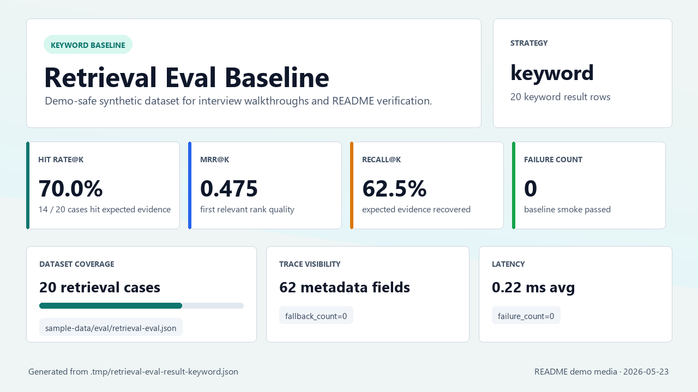

# DocuRAG AgentOps Development Log

> 這份文件保留原本 root README 的開發紀錄、release log、本地啟動細節與 ticket-first 備忘。面試官快速入口請回到 [README.md](./README.md)。

## Original Project Overview

DocuRAG AgentOps 是一個面試展示用的 AI 文件平台 side project，用來呈現企業級文件上傳、OCR、local RAG、citation trace 與 AgentOps 產品思維。

目前主線已完成 local document workflow、provider-selected PaddleOCR OCR flow、PP-OCRv4 mobile 中文 / 中英混合模型設定、backend startup preload、provider reuse、OCR timing metadata、mock OCR override、VLM-first parser provider spike、OCR / VLM evidence alignment、Agent tool-use trace surface、manual vector indexing、Qdrant vector retrieval、hybrid / `hybrid_rerank` retrieval runtime、FastEmbed rerank adapter、Ollama Qwen3.5 generation、direct `.txt` ingestion、text-native PDF extraction、demo auth mode、後台內建「測試RAG」基準測試，以及可重跑的本機 backend validation。v0.27.0 起預設採激進 demo 模式：RAG 查詢優先走 `hybrid_rerank`，frontend 後台 ingestion 會 best-effort 執行 parser 與 vector indexing；v0.27.1 起 VLM request 同時帶圖片與 OCR context，欄位結果會嘗試對回 OCR line / bbox；v0.28.0 起 `.txt` / text-native PDF 可成為 first-class retrieval source，demo auth mode 可展示 Admin / Analyst / Viewer role gates；v0.29.0 起 Admin / Analyst 可在後台直接執行固定 `hybrid_rerank` 的 built-in retrieval benchmark；v0.29.0 follow-up hardening 起 Ollama VLM response parsing 支援 `response` / `thinking` / fenced JSON，後台 ingestion file picker 支援多檔依序處理，default `hybrid_rerank` 會用目前文件範圍查 Qdrant，Ollama generation 也預設關閉 thinking 並限制輸出長度。v0.32.0 起 formal Auth / RBAC / tenant boundary 已形成可展示 release，backend 會執行 signed bearer guard、project access filtering 與 Viewer forbidden，frontend 會依 Admin / Analyst / Viewer 對齊可見入口。v0.33.0 起 Redis + NATS worker demo milestone 已完成：Redis cache / rate limit、NATS memory worker skeleton、task status API 與 worker demo smoke 可本機驗證。v0.34.0 起 scanned PDF OCR baseline 已完成：scanned / mixed PDF 可 render page images、執行 provider-selected page OCR、建立 `pdf_page_ocr` chunks，並用 smoke 驗證 parser / RAG handoff。v0.35.0 起 RAG indexing quality release 已完成：vector indexing 可選 chunking strategy，Qdrant payload filter 可依 tenant / project / document / source 收斂範圍，並有 reindex / stale vector cleanup smoke。v0.36.0 起 eval dashboard / rerank analysis release 已完成：Admin / Analyst 可管理 eval dataset，執行 keyword、vector、hybrid、vector_rerank、hybrid_rerank strategy comparison，並查看 Hit Rate@K、MRR@K、Recall@K、failure / fallback cases、trace metadata coverage 與 rerank 前後排名 / score。v0.37.0 起 inference ops / vLLM serving demonstration 已完成：OpenAI-compatible provider boundary、local vLLM / Docker guide、benchmark smoke、latency / token / throughput / KV cache / GPU memory estimate 與 provider unavailable fallback report 已同步。v0.38.0 起 Agent runtime hardening 已完成：受控 LLM planner provider boundary、deterministic fallback、read-only tool permission guard、permission trace 與 forbidden tool boundary 已形成 release。外部 runtime 不可用時清楚 fallback。這仍是受控 MVP，不是 production OCR accuracy tuning、layout understanding、LLM-as-judge、answer faithfulness、citation quality scoring、production inference gateway、multi-GPU serving、model registry、RAG / VLM parser / autonomous Agent / identity provider / autoscaling worker 平台。

v0.39.0 已完成 deployment / observability / fine-tuning track release sync：K8s baseline manifests、opt-in Loki / Grafana local observability path、RAG / eval / worker JSONL trace logs 與 research-only synthetic data artifacts 已整理成可驗證交付物；這仍不是 production autoscaling、multi-cluster deployment、managed secret integration、production alerting / incident workflow 或 production training pipeline。
v0.40.0 已完成 Phase 40 JD evidence hardening release sync：Embedding / SFT research evidence、inference hardware benchmark evidence（KV cache / TOPS / provider skip reason）與 observability dashboard evidence 已整理成可驗證的面試證據包；這仍不是 production training、production inference autoscaling、production alerting / incident workflow 或 production guarantee。
v0.41.0 已完成 Phase 41 RAG quality regression / DatasetOps release sync：golden dataset metadata、CI-safe retrieval regression report、chunking / indexing ablation report 與 keyword baseline gate 已整理成可驗證品質回歸證據；這仍不是 production eval dashboard、LLM-as-judge、DB eval history、排程任務或外部 monitoring。

Phase 41-45 已新增為 JD completion / portfolio roadmap：Phase 41 RAG quality regression / DatasetOps 已在 `v0.41.0` 完成 release sync，Phase 42 聚焦 inference gateway / capacity planning，Phase 43 聚焦 AgentOps governance / secure tool runtime，Phase 44 聚焦 Document Intelligence QA / human review loop，Phase 45 聚焦 final interview portfolio pack。Phase 41 形成 golden dataset、CI-safe regression report 與 ablation artifact；這不代表 production eval dashboard 或 LLM-as-judge 已完成。後續仍需遵守 ticket-first、scope / out-of-scope 與 release sync 規範。

## Project Goal

DocuRAG AgentOps 要展示三件事：

- 文件智能平台的產品流程：後台上傳文件後可保存 metadata、執行 OCR、產生 chunks，前台則用客服式 RAG chat 查詢已建置的知識庫。
- RAG 工程能力：回答問題時保留 citations、retrieved chunks 與 trace metadata。
- 可維護的 AI application 架構：backend、frontend、docs、tasks、infra 與 sample data 的責任邊界清楚。

## Current Scope

目前最新主線包含：

- FastAPI backend，提供 healthcheck、文件上傳、文件列表、文件詳情、OCR result 與 RAG query API。
- Local JSON metadata store，保存 document metadata、OCR result、chunks、processing status 與 processing job metadata。
- Provider-selected OCR endpoint：`POST /documents/{document_id}/ocr` 預設走 PaddleOCR。
- Mock OCR override：`POST /documents/{document_id}/ocr/mock` 可在沒有 real OCR runtime 時重跑 demo-safe flow。
- OCR line normalization，將 OCR text、page、bbox、confidence 與 metadata 映射到 chunks 與 citations。
- PaddleOCR 預設固定 `lang=ch`、`ocr_version=PP-OCRv4`、`PP-OCRv4_mobile_det` / `PP-OCRv4_mobile_rec`，並保留 model dir env override。
- Backend startup 會在 selected provider 為 PaddleOCR 時 preload engine；provider-selected OCR request 會重用同一個 provider / engine。
- PaddleOCR result metadata 會輸出 safe timing 欄位：engine preload / request load / inference / normalization / total duration。
- v0.9.1 預設 `DOCURAG_OCR_USE_ANGLE_CLS=false`、`DOCURAG_OCR_DET_LIMIT_SIDE_LEN=960`、`DOCURAG_OCR_REC_BATCH_NUM=6`；mock OCR path 不受影響。
- Local keyword RAG baseline，回傳 deterministic answer、citations 與 retrieved chunks。
- v0.10.0 已固定 LLM / VLM 第一版目標為 Ollama `qwen3.5:4b`，並新增最小 Ollama LLM client、可選 `/rag/query` generation path、demo smoke `-RunLlm` 與 frontend answer source；20-12 local demo follow-up 起，未覆寫時預設嘗試 Ollama `qwen3.5:4b` generation，Ollama 不可用時回到 retrieved OCR chunks fallback，若要 deterministic baseline 可設定 `DOCURAG_LLM_PROVIDER=`。
- v0.11.0 已新增 disabled-by-default Ollama embedding client、optional Qdrant local runtime / collection smoke 與 fallback-safe vector retrieval path。
- v0.12.0 已新增 manual vector indexing service / API；只有明確呼叫 `POST /documents/{document_id}/index/vector` 後，vector retrieval demo 才會查詢已索引到 Qdrant 的 chunks，失敗會回到 keyword baseline。
- v0.13.0 已新增公開 retrieval eval dataset、本機 evaluation runner、Hit Rate@K / MRR@K / Recall@K / latency / failure count metrics，以及 baseline / optional vector eval smoke。
- v0.15.0 已新增 disabled-by-default FastEmbed rerank adapter building block、optional `vector_rerank` eval strategy、rerank trace metadata 與 `-RunVectorRerank` smoke flag；未啟用 rerank provider 時會保留 vector candidates 並記錄 fallback reason。
- v0.16.0 已將公開 retrieval eval dataset 擴充到 12 筆，新增 optional `hybrid` eval strategy 與 `-RunHybrid` smoke flag；`hybrid` 只用於 eval runner，不接 `/rag/query` 或 frontend UI。
- v0.17.0 已新增 frontend compact retrieval trace panel，並改善 retrieval eval summary visibility；UI 只讀既有 RAG response metadata，eval summary 顯示 fallback count、trace metadata count 與 result strategy counts，不新增 backend API 或 production eval dashboard。
- v0.18.0 已完成 `hybrid_rerank` planning backlog；這是 Markdown-only planning，不代表 runtime、eval runner、frontend UI 或 smoke flag 已可用。
- v0.19.0 已完成 optional `hybrid_rerank` eval strategy：eval provider、`-RunHybridRerank` smoke flag、trace / report metadata naming 與 release sync；這仍只屬於 retrieval eval runner，不接 default `/rag/query` 或 frontend chat。
- v0.20.0 已完成 interview MVP packaging：demo script、sample / eval coverage、README demo media、baseline validation 與 release 文件同步；不新增 production eval dashboard、worker、DB、auth 或 deployment。
- v0.21.0 已將 frontend 文件上傳主線改為 provider-selected real GPU OCR-first；失敗時才顯示手動 mock OCR fallback，不再靜默使用 mock OCR。
- v0.22.0 已強化 default keyword RAG query normalization：中文查詢與常見 demo alias 可命中既有英文 OCR chunks，例如「付款期限是什麼？」可命中 `Payment terms: Net 15`；這不是 default-on vector、hybrid 或 rerank。
- v0.23.0 已完成 Viewer Chat / Admin Ingestion role split：前台 Viewer 只查詢已建立知識庫，後台 Admin / Analyst 才執行 upload、provider-selected OCR 與 ingestion 狀態檢查；這不是 auth / RBAC 或 production indexing。
- v0.24.0 已完成 VLM / Parser Minimal MVP：新增 VLM-compatible parser contract、deterministic invoice parser fallback、`POST /documents/{document_id}/parse`、`GET /documents/{document_id}/fields`、local JSON parser result persistence、frontend structured fields surface 與 parser demo smoke；這不是 production VLM parser、LLM parser、worker、DB 或 Agent runtime。
- v0.25.0 已完成 Agent Tool-use Minimal MVP：以 deterministic planner + allowlisted tools 串接 structured fields、document search 與 deterministic invoice summary，提供 `POST /agent/run`、`GET /agent/runs/{run_id}`、frontend Agent trace surface 與 demo smoke validation；這不是 production autonomous Agent、LLM planner、權限系統或任意 tool execution。
- v0.26.0 已完成 Real VLM Parser Provider Spike：以 VLM-first provider、demo-safe image input resolver、`vlm_invoice` adapter、parser source comparison、fake / stub smoke success path 與 unavailable fallback validation 承接 structured fields；`deterministic_invoice` 只作 fallback / debug override，Agent contract 不變，只透過 `get_document_fields` 消費 parser result。
- v0.27.0 已啟用 Aggressive Demo Defaults：`DOCURAG_RAG_RETRIEVAL_PROVIDER=hybrid_rerank`、`DOCURAG_EMBEDDING_PROVIDER=ollama`、`DOCURAG_RERANK_PROVIDER=fastembed` 成為預設；`/rag/query` 與 Agent `search_documents` 會優先使用 hybrid rerank，embedding / Qdrant / reranker 不可用時回到 keyword evidence 並留下 trace。
- v0.27.1 已完成 OCR / VLM Evidence Alignment：VLM parser request 同時包含原始圖片與 compact OCR context，`vlm_invoice` 欄位值若可命中 OCR line 會保存 `source_text`、`source_page` 與 `source_bbox`；未命中時以 `evidence_unmatched` / `evidence_unavailable` 標示，不把 VLM fields 混入 RAG corpus。
- v0.28.0 已完成 Document Sources / Demo Auth Mode：`.txt` 直接建立 `text_upload` chunks，text-native PDF 以 `pypdf` 抽取文字層建立 `pdf_text` chunks，scanned / empty PDF 只標示 `pdf_scanned_pending_ocr`；`DOCURAG_AUTH_MODE=demo` 可登入 Admin / Analyst / Viewer，backend ingestion write API 會擋下 Viewer。
- v0.29.0 已完成 Built-in RAG Eval Admin Surface：後台「測試RAG」固定執行 `hybrid_rerank` 內建基準測試，使用 10 張 demo-safe synthetic 中文發票 fixture，UI 只顯示 Hit Rate@K、MRR@K、平均延遲與 Failure / Fallback；Agent 執行紀錄改成可摺疊。
- v0.29.0 follow-up hardening 已完成 VLM response / frontend ingestion 修正：Ollama adapter 可解析 `response` / `thinking` / fenced JSON、金額字串、confidence label 與 line item alias；後台檔案選擇可多選，frontend 逐檔走既有 upload / OCR / parser / vector indexing flow，不新增 batch API 或 worker，不 bump version。
- v0.29.0 follow-up hardening 已完成 RAG runtime 修正：Qdrant search 會用目前 backend 已載入的 document ids 篩掉 stale vectors，避免舊 eval / demo points 消耗 `top_k` 後誤報 `vector_unavailable`；Ollama `/api/generate` 預設帶 `think=false` 與 `options.num_predict=512`，並把 guardrail 寫入 citation trace。
- Phase 31 `31-02` 已完成 PostgreSQL boundary / migration policy 文件：盤點 local JSON store 資料域、對應 future DB domain、固定 Alembic migration policy 方向、rollback / downgrade 原則與 local JSON fallback / migration path；本 ticket 不新增 schema、migration 檔、repository runtime 或版本更新。
- Phase 31 `31-03` 已完成 DB schema contract 文件：固定 documents、pages、chunks、fields、processing jobs、eval runs 與 Agent runs 的 table contract、nullable `project_id` future tenant metadata、index / key 與 local JSON mapping；本 ticket 不新增實際 database schema、migration、dependency、repository runtime 或版本更新。
- Phase 31 `31-04` 已完成 repository adapter / migration path runtime slice：新增 `LocalJsonDocumentRepository` / `PostgresDocumentRepository`、`DOCURAG_REPOSITORY_PROVIDER=local_json|postgresql` runtime selection、`DOCURAG_DATABASE_URL`、`scripts/migrate-local-json-to-postgresql.py` 與 backend repository tests；local JSON 仍為預設，PostgreSQL 為 opt-in，`psycopg[binary]` 只放在 optional `backend[postgres]` extra。
- v0.31.0 已完成 Phase 31 release sync：backend / frontend / Docker Compose / health test 版本同步到 `0.31.0`，README / README_DEV / backend README / frontend README / TODO / ROADMAP 已補齊 PostgreSQL / schema / repository foundation 狀態；仍不包含正式 RBAC、worker pipeline 或 production deployment。
- Phase 32 `32-01` 已完成正式 Auth / RBAC / tenant boundary contract：定義 User、Organization、Project、Role、Membership、project access、Viewer / Analyst / Admin permission matrix 與 API guard policy；本 ticket 只更新 Markdown，不新增 schema、migration、runtime login、Redis session、SSO、OAuth、MFA、frontend role surface 或 backend guard。
- Phase 32 `32-02` 已完成正式 Auth / RBAC schema foundation：新增 `users`、`organizations`、`projects`、`roles`、`memberships`、`project_memberships` PostgreSQL schema、`scripts/migrate-auth-rbac-schema.py`、demo seed users / disabled user password-hash persistence 與 backend tests；本 ticket 不 bump version，不替換 Phase 28 demo auth，也尚未完成 endpoint permission guards。
- Phase 32 `32-03` 已完成 backend permission guards：新增 `DOCURAG_AUTH_MODE=formal` signed bearer token parsing、project access context、Analyst / Admin write guard、Viewer forbidden、document / RAG / Agent project filtering 與 formal-mode tests；本 ticket 不 bump version，不新增 frontend role surface、Redis session、SSO、OAuth、MFA 或 production login runtime。
- Phase 32 `32-04` 已完成 frontend role surface 與 `v0.32.0` release sync：Admin / Analyst 可使用 ingestion、built-in eval 與 Agent write surface，Viewer 只能查詢；frontend / backend / Docker Compose / health test 版本與 README / TODO / ROADMAP 已同步。本 ticket 不新增 SSO、OAuth、MFA、Redis session、worker、deployment hardening 或 production login runtime。
- Phase 33 `33-01` 已完成 Redis / NATS worker pipeline contract：定義 Redis session / query cache / rate limit / worker lock / short-term chat history 邊界、NATS / JetStream topics、task status lifecycle、retry policy 與 idempotency key；本 ticket 只更新 Markdown，不新增 Redis / NATS runtime service、worker code、dependency、migration 或 deployment 設定。
- Phase 33 `33-02` 已新增 opt-in Redis backend slice：`DOCURAG_REDIS_URL` 設定後可 best-effort 使用 session cache、RAG query cache 與 rate limit；Redis Python client 收斂在 optional `backend[redis]` extra，未安裝、未設定或 Redis 不可用時維持既有 demo fallback，不新增 NATS、worker、async queue 或 production session runtime。
- Phase 33 `33-03` 已新增 NATS worker skeleton 與 task status slice：`DOCURAG_NATS_URL=memory://` 可跑 publish / consume smoke，optional `backend[nats]` 可連真實 NATS；`/tasks` 可讀取 queued / running / succeeded / failed task records。這不是 production async OCR / parser / indexing / eval worker pipeline。
- v0.33.0 已完成 Phase 33 release sync：backend / frontend / Docker Compose / health test 版本同步到 `0.33.0`，`scripts/worker-demo-smoke.ps1` 可驗證 Redis fake-client path、NATS memory worker skeleton 與 `/tasks` task status API。
- Phase 34 `34-01` 已完成 scanned PDF OCR contract：固定 text-native PDF、scanned PDF、mixed PDF、invalid PDF 分流，以及 page image、OCR block、page-level status、retry / failure reason、parser / chunks / indexing / worker handoff 邊界；本 ticket 只更新 Markdown，不新增 PDF rendering runtime 或 OCR code。
- Phase 34 `34-02` 已完成 demo-safe PDF rendering page image pipeline：新增 `PyMuPDF` dependency，scanned PDF 會產生 bounded PNG page images 與 metadata；mixed PDF 保留 text pages 的 `pdf_text` chunks，並只為 scanned pages 建立 `pdf_mixed_pending_ocr` page images。
- Phase 34 `34-03` 已完成 multipage OCR status / retry：`POST /documents/{document_id}/ocr` 會對 scanned / mixed PDF page images 執行 provider-selected OCR，保存 page-level OCR text / blocks / attempts / provider / failure reason，並產生 `pdf_page_ocr` chunks；mixed PDF 會保留既有 `pdf_text` chunks。Release sync 留到 `34-04`。
- v0.34.0 已完成 Phase 34 release sync：backend / frontend / Docker Compose / health test 版本同步到 `0.34.0`，`scripts/scanned-pdf-ocr-smoke.ps1` 會驗證 PDF rendering、page OCR chunks、parser 與 RAG handoff。
- Phase 35 `35-01` 已完成 indexing quality contract：文件已固定 `fixed_size`、`semantic`、`parent_child` chunking 策略、Qdrant payload / tenant / project / document filter boundary、reindex 與 stale vector cleanup；本 ticket 不 bump version、不新增 runtime code。
- Phase 35 `35-02` 已完成 chunking strategy runtime：`POST /documents/{document_id}/index/vector` 可選 `fixed_size` / `semantic`，並保存 strategy、char / token count、source type 與 page metadata；`semantic` 不使用 LLM segmentation。
- Phase 35 `35-03` 已完成 Qdrant payload index / reindex runtime：vector payload 會保存 tenant / project / source metadata，Qdrant search 支援 tenant / project / document / source filters，document indexing 可選 stale cleanup，並新增 project reindex API / smoke。
- v0.35.0 已完成 Phase 35 release sync：backend / frontend / Docker Compose / `.env.example` / health test 版本同步到 `0.35.0`，`scripts/indexing-quality-smoke.ps1` 會驗證 chunking strategy、Qdrant payload filter、reindex 與 stale vector cleanup；這不是 production eval dashboard 或 LLM-as-judge。
- Phase 36 `36-01` 已完成 eval dashboard / rerank analysis contract：文件固定未來 eval dataset、eval item、eval run、strategy comparison、failure / fallback cases、Hit Rate / MRR / Recall / Precision / latency 指標，以及 rerank 前後排名 / score / trace metadata coverage；本 ticket 不 bump version、不新增 dashboard runtime 或 UI。
- Phase 36 `36-02` 已完成 eval dataset management runtime：Admin / Analyst 可透過 backend API 與 frontend 後台 surface 管理 eval datasets / eval items，Viewer write path 會被擋下；本 ticket 不 bump version，不新增 strategy comparison dashboard 或 retrieval / rerank runtime behavior。
- Phase 36 `36-03` 已完成 strategy comparison 與 rerank analysis runtime：Admin / Analyst 可對 eval dataset 執行 keyword、vector、hybrid、vector_rerank、hybrid_rerank comparison，後台可查看 Hit Rate@K、MRR@K、Recall@K、latency、failure / fallback cases、trace metadata coverage 與 rerank 前後排名 / score；本 ticket 不 bump version，release sync 留到 `36-04`。
- v0.36.0 已完成 Phase 36 release sync：backend / frontend / Docker Compose / `.env.example` / health test 版本同步到 `0.36.0`，`scripts/eval-dashboard-smoke.ps1` 會驗證 eval dataset、strategy comparison、failure / fallback cases 與 rerank analysis；這不是 LLM-as-judge、answer faithfulness、citation quality scoring 或 production monitoring trend。
- v0.37.0 已完成 Phase 37 release sync：backend / frontend / Docker Compose / `.env.example` / health test 版本同步到 `0.37.0`，OpenAI-compatible provider 可明確啟用，`scripts/inference-benchmark-smoke.ps1` 會記錄 latency、tokens、throughput、KV cache / GPU memory estimate，vLLM unavailable 時產出 skipped report；這不是 production inference gateway、multi-GPU serving、K8s autoscaling、model registry 或 secret vault。
- Phase 37 `37-01` 已完成 inference provider ops contract：文件固定 Ollama / OpenAI-compatible / vLLM provider boundary、prompt / completion token metrics、latency / throughput、GPU memory / KV cache estimate，以及 unavailable / timeout / malformed response fallback；本 ticket 不 bump version、不新增 OpenAI-compatible client runtime 或 vLLM server。
- Phase 37 `37-02` 已完成 OpenAI-compatible LLM adapter：`DOCURAG_LLM_PROVIDER=openai_compatible` 可讓 RAG generation 呼叫 `{base_url}/chat/completions`，並回填 token、latency、finish reason、provider request id 與 fallback metadata；Ollama default / fallback 保留，本 ticket 不新增 vLLM server、OpenAI SDK、VLM parser runtime 或 Agent planner 變更。
- Phase 37 `37-03` 已完成 vLLM local serving / benchmark docs 與 smoke：`scripts/inference-benchmark-smoke.ps1` 可對 OpenAI-compatible `/v1/chat/completions` 記錄 latency、tokens、throughput、KV cache / GPU memory estimate；vLLM 不可用時會產出 skipped report 並說明 Ollama / deterministic fallback，不宣稱 production inference serving 完成。
- Phase 38 `38-01` 已完成 Agent runtime permission contract：文件固定 deterministic fallback、future LLM planner provider boundary、tool tiers、permission guard、project access check、human confirmation requirement、trace fields 與 forbidden tool boundary；本 ticket 不 bump version、不新增 LLM planner runtime 或 tool execution code。
- Phase 38 `38-02` 已完成 LLM planner provider boundary runtime slice：`DOCURAG_AGENT_PLANNER_PROVIDER=llm_planner` 可明確啟用 LLM plan attempt，輸出經 JSON schema 與 safe route / tool sequence validation 後才會交給既有 allowlisted tools；timeout、unavailable 或 invalid plan 會回到 deterministic fallback。本 ticket 不 bump version、不新增任意 SQL / shell / filesystem / destructive tool。
- Phase 38 `38-03` 已完成 Agent tool permission guards 與 trace：既有 Agent tools 已標記 `read-only` tier、required roles、side-effect policy 與 human confirmation status，backend 會在 tool execution 前做 role / project / tier guard，frontend Agent trace 會顯示 permission decision、阻擋工具、tool tier 與 fallback reason。本 ticket 不 bump version、不新增 destructive tool。
- v0.38.0 已完成 Phase 38 release sync：backend / frontend / Docker Compose / `.env.example` / health test 版本同步到 `0.38.0`，`scripts/agent-runtime-smoke.ps1` 可驗證 planner fallback、tool permission guard、Viewer forbidden 與 trace 欄位；仍不允許任意 SQL、shell、filesystem command、destructive tool、production approval workflow 或 production autonomous Agent。
- Phase 39 `39-01` 已完成 deployment / observability / fine-tuning research contract：文件定義 K8s baseline scope、Loki + Grafana observability path、API / worker / RAG / eval trace logging boundary，以及 fine-tuning / synthetic data / embedding tuning research-only scope；本 ticket 不 bump version、不新增 K8s manifest、observability runtime、notebook、dependency 或 runtime change。
- Phase 39 `39-02` 已完成 K8s manifest baseline：`infra/k8s/` 提供 backend API、frontend、worker placeholder、Qdrant、Redis、NATS、ConfigMap、Secret template、readiness / liveness probes、resources examples、rollout / rollback docs 與 optional HPA shape；本 ticket 不 bump version、不新增 production autoscaling、Ingress TLS、Helm、GitOps、enterprise secret manager、production database deployment 或 runtime behavior change。
- Phase 39 `39-03` 已完成 observability baseline：`DOCURAG_OBSERVABILITY_LOG_PATH` 可 opt-in 匯出 API / RAG / eval / worker JSONL events，`infra/observability/` 提供 Loki + Grafana / Promtail local path 與 LogQL query examples；未設定或寫入失敗時 app 不 hard fail。
- Phase 39 `39-04` 已完成 fine-tuning / synthetic data research artifacts：`fine-tuning/` 提供 research-only dataset card、notebook skeleton、evaluation template 與風險邊界，`sample-data/fine-tuning/` 提供 SFT JSONL、embedding positive / negative pairs 與 reranker pairwise samples；不跑 training、不下載大型模型、不接 production runtime。
- Vue 3 + Vite frontend 目前仍是受控 demo surface；Phase 27 起預設開啟 Admin / Analyst Ingestion 入口，文件上傳完成 OCR 後會 best-effort 執行 VLM-first parser 與 Qdrant vector indexing。Phase 28 起若啟用 demo auth mode，UI 會先顯示 login screen，並依 role 顯示 Viewer 或 Admin / Analyst surface。Phase 29 起 Admin / Analyst 後台可直接執行 built-in RAG benchmark，Viewer 不顯示後台測試與 Agent 操作。Phase 30 hardening 起後台可一次選多檔並依序處理；RAG 查詢也會避開 stale Qdrant vectors，並對 Ollama answer generation 使用 demo latency guardrails。Phase 32 起 role surface 會把 Viewer 導向 read-only 查詢，並鎖住 ingestion / eval / Agent write 操作。OCR detail、document list、raw JSON 與 detailed trace table 可透過 backend API / CLI / smoke scripts 檢查；production-grade durable worker / production DB pipeline 尚未實作。
- Python 3.12 backend runtime；real OCR 只支援 PaddlePaddle GPU / CUDA runtime，dependency 收斂在 `backend[real-ocr]` optional extra。
- Dockerfile / Docker Compose backend runtime，real OCR GPU dependency 可透過 build arg 開啟。

目前仍刻意不實作：

- Scanned PDF 目前已有 demo-safe page image OCR、page status 與 retry path；仍不做 image preprocessing、版面分析、table reconstruction、human correction workflow、OCR accuracy tuning 或 production GPU scheduling。
- Production-grade VLM parser、production vision runtime、production-grade PDF rendering、多頁 parser pipeline、人工修正欄位版本紀錄或表格完整重建。
- LLM-as-judge、answer faithfulness scoring、production eval dashboard、自訂 eval dataset、streaming UI、production inference gateway、OpenAI billing / secret vault 或 production vLLM serving。
- Production autonomous Agent、任意 SQL / tool execution 或 destructive tools。Phase 38 runtime 目前只允許受控 LLM planner boundary 與既有 read-only tools 的 permission-guarded execution。
- Production NATS event bus、durable JetStream consumer、async OCR / parser / indexing / eval worker execution、production PostgreSQL operation、destructive migration、production login runtime、SSO、OAuth、MFA、enterprise identity provider、production audit pipeline，或 Redis session rotation / worker lock runtime。
- Production-grade K8s deployment、observability runtime 或 production training pipeline。Phase 39 `39-03` 目前只完成 opt-in local observability baseline，不包含 production alerting、SLO、distributed tracing、APM vendor integration、incident workflow 或 long-term storage；Phase 39 `39-04` 只提供 research-only fine-tuning / synthetic data artifacts，不包含 training job、model registry、deployment automation 或 production model improvement claim。

## Interview Demo Path

5 到 10 分鐘面試導覽建議：

1. Demo 前先用 `scripts/seed-demo-data.ps1` 或 backend API 預載公開 synthetic sample，讓前台像客服機器人一樣直接提問。
2. 若以 `DOCURAG_AUTH_MODE=demo` 啟動，先展示 Admin / Analyst / Viewer login 與 Viewer read-only surface。
3. 第一屏用 `payment due date Net 15` 詢問 RAG，展示 answer source、retrieval source 與簡化引用來源。
4. 說明產品入口拆分：前台 Viewer Chat 只查詢已建立知識庫；文件上傳與 OCR 是 Admin / Analyst 的後台 ingestion flow，實際 OCR、metadata、chunks 與 detailed trace 由 backend / CLI 層檢查；正式知識庫 ingestion / indexing pipeline 尚未實作。
5. 在後台觸發 VLM-first parser 後執行 Agent trace demo，說明 `vlm_invoice` / `deterministic_invoice` fallback 如何保存 structured fields，再由受控 planner 使用 `get_document_fields`、`search_documents`、`summarize_invoice_fields` 形成 source-backed final answer；若啟用 `llm_planner`，計畫必須通過 safe route / tool sequence validation，失敗就回 deterministic fallback。
6. 在後台執行「測試RAG」，說明 10 張 synthetic 中文發票 fixture、固定 `hybrid_rerank`、Hit Rate@K、MRR@K、平均延遲與 Failure / Fallback。
7. 若面試官想看工程細節，再切到 API docs、smoke script output 或 eval CLI 說明 strategy、fallback state 與 trace metadata。
8. 補充激進預設：`hybrid_rerank` 現在接到 default `/rag/query` 與 Agent search，`vector`、`vector_rerank`、`hybrid` 仍可用 env 明確切換；內建後台 eval 是 retrieval benchmark，不是 production eval dashboard。

## Recommended Viewer Chat / Admin Ingestion Demo

這是 Phase 23 的產品邊界：Viewer 前台只負責 Chat 查詢既有知識庫；Admin / Analyst 後台才操作文件上傳與 ingestion。現有 backend upload 後可呼叫 provider-selected real GPU OCR；若 GPU OCR runtime 不可用，後台 ingestion flow 可保留已上傳文件並使用手動 mock OCR fallback。mock 不再是上傳主線，也不是 Viewer Chat 體驗的一部分。

1. 啟動 real GPU OCR backend：

```powershell
cd backend
py -3.12 -m pip install "paddlepaddle-gpu==3.3.0" -i https://www.paddlepaddle.org.cn/packages/stable/cu129/
py -3.12 -m pip install -e ".[dev,real-ocr]"
$env:DOCURAG_OCR_PROVIDER="paddleocr"
py -3.12 -m uvicorn app.main:app --reload
```

2. 另開 terminal 啟動 frontend：

```powershell
cd frontend
npm.cmd install
npm.cmd run dev
```

3. 回到 repo root，可先預載客服 chat 的 demo knowledge base；若要同時驗證 real OCR sample，加上 `-RunRealOcr`：

```powershell
powershell -NoProfile -ExecutionPolicy Bypass -File .\scripts\seed-demo-data.ps1
powershell -NoProfile -ExecutionPolicy Bypass -File .\scripts\seed-demo-data.ps1 -RunRealOcr
```

4. 打開 frontend，先展示 Viewer Chat 查詢既有 demo knowledge base；再切到 Admin / Analyst ingestion surface 或 backend API / CLI，使用 `sample-data/documents/sample-ocr-invoice.png` 驗證 GPU OCR-first upload flow：

```text
http://localhost:5173
payment due date Net 15
```

5. 展示回答與簡化引用來源：

- `answer source`：預設會嘗試 `ollama/qwen3.5:4b`；Ollama 不可用時是 `LLM unavailable fallback`；若以 `DOCURAG_LLM_PROVIDER=` 明確關閉則是 deterministic baseline。
- `retrieval source`：預設優先顯示 `hybrid_rerank`；若 Ollama embedding、Qdrant 或 FastEmbed reranker 不可用，會顯示 fallback 狀態並回到 keyword evidence。
- `引用來源`：回答對應的來源文件與引用片段數。
- detailed trace / retrieved chunks：由 backend response、smoke script 或 eval CLI 檢查，不在 frontend 主畫面攤開。

Frontend / backend demo 分工：

| 區域 | 面試說法 |
|---|---|
| 前台 Viewer Chat | Viewer 只需要詢問已建立的知識庫，並查看回答、answer source、retrieval source 與簡化引用來源。 |
| 後台 Admin / Analyst Ingestion | Admin / Analyst 可以把文件送到 backend upload + provider-selected GPU OCR flow，檢查 OCR / local chunks / metadata 狀態；正式 parser、worker、production DB pipeline 與 production indexing pipeline 尚未實作。 |
| Retrieval eval smoke | 開發者用 CLI 量化 Hit Rate@K、MRR@K、Recall@K、failure count 與 trace metadata count。 |

CLI smoke 的 mock-safe baseline 仍可在無 GPU / 無 Qdrant 環境驗證 API；完整進階展示時，先啟動 Ollama embedding、Qdrant collection 與可用 reranker runtime，`hybrid_rerank` 會從 fallback 變成完整進階路徑。

工程細節 demo media：



## Local Run

Windows CMD 進階 demo 全開時，環境變數請用 `set "KEY=value"`，不要用 Git Bash / Linux 的 `export`。`set` 只對目前這個 CMD 視窗有效，所以 backend env 必須和 `python -m uvicorn ...` 放在同一個 terminal：

```bat
cd /d C:\Users\USER\Desktop\DocuRAG
docker-compose -f infra\docker-compose.yml up -d qdrant
powershell -NoProfile -ExecutionPolicy Bypass -File .\scripts\qdrant-collection-smoke.ps1
powershell -NoProfile -ExecutionPolicy Bypass -File .\scripts\ollama-embedding-smoke.ps1

cd /d C:\Users\USER\Desktop\DocuRAG\backend
python -m pip install -e ".[dev,real-ocr]"
set "DOCURAG_AUTH_MODE=demo"
set "DOCURAG_AUTH_DEMO_SECRET=change-this-local-demo-secret"
set "DOCURAG_OCR_PROVIDER=paddleocr"
set "DOCURAG_LLM_PROVIDER=ollama"
set "DOCURAG_LLM_BASE_URL=http://127.0.0.1:11434"
set "DOCURAG_LLM_MODEL=qwen3.5:4b"
set "DOCURAG_LLM_THINK=false"
set "DOCURAG_LLM_NUM_PREDICT=512"
set "DOCURAG_AGENT_PLANNER_PROVIDER=deterministic"
set "DOCURAG_VLM_PROVIDER=ollama"
set "DOCURAG_VLM_BASE_URL=http://127.0.0.1:11434"
set "DOCURAG_VLM_MODEL=qwen3.5:4b"
set "DOCURAG_RAG_RETRIEVAL_PROVIDER=hybrid_rerank"
set "DOCURAG_EMBEDDING_PROVIDER=ollama"
set "DOCURAG_EMBEDDING_BASE_URL=http://127.0.0.1:11434"
set "DOCURAG_EMBEDDING_MODEL=qwen3-embedding:0.6b"
set "DOCURAG_QDRANT_URL=http://127.0.0.1:6333"
set "DOCURAG_QDRANT_COLLECTION=docurag_chunks_v1"
set "DOCURAG_QDRANT_VECTOR_SIZE=1024"
set "DOCURAG_RERANK_PROVIDER=fastembed"
set "DOCURAG_RERANK_MODEL=BAAI/bge-reranker-base"
python -m uvicorn app.main:app --reload
```

另一個 CMD terminal 啟動 frontend：

```bat
cd /d C:\Users\USER\Desktop\DocuRAG\frontend
set "VITE_API_BASE_URL=http://127.0.0.1:8000"
npm.cmd install
npm.cmd run dev
```

使用 Python 3.12 啟動 backend：

```powershell
cd backend
py -3.12 -m pip install "paddlepaddle-gpu==3.3.0" -i https://www.paddlepaddle.org.cn/packages/stable/cu129/
py -3.12 -m pip install -e ".[dev,real-ocr]"
py -3.12 -m uvicorn app.main:app --reload
```

Backend API：

```text
http://127.0.0.1:8000
http://127.0.0.1:8000/docs
```

Ollama RAG generation 預設會在 backend 啟動時嘗試使用 `DOCURAG_LLM_PROVIDER=ollama`；若要確認完整 LLM demo，先啟動 Ollama 並確認 `qwen3.5:4b` 在本機模型清單中，再用下列 env 明確啟動 backend。`DOCURAG_LLM_THINK=false` 與 `DOCURAG_LLM_NUM_PREDICT=512` 是預設 demo latency guardrails；5070 Ti 這類顯卡仍可能因 thinking tokens 慢，debug 時可手動改值比較模型行為，但 demo default 不建議打開 thinking。若要關閉 LLM generation，將 `DOCURAG_LLM_PROVIDER` 設為空字串。

```powershell
$env:DOCURAG_LLM_PROVIDER="ollama"
$env:DOCURAG_LLM_BASE_URL="http://127.0.0.1:11434"
$env:DOCURAG_LLM_MODEL="qwen3.5:4b"
$env:DOCURAG_LLM_THINK="false"
$env:DOCURAG_LLM_NUM_PREDICT="512"
py -3.12 -m uvicorn app.main:app --reload
```

回到 repo root 後可執行 baseline smoke 與 LLM smoke：

```powershell
powershell -NoProfile -ExecutionPolicy Bypass -File .\scripts\demo-smoke-test.ps1
powershell -NoProfile -ExecutionPolicy Bypass -File .\scripts\demo-smoke-test.ps1 -RunLlm
powershell -NoProfile -ExecutionPolicy Bypass -File .\scripts\agent-runtime-smoke.ps1
```

可選 Ollama embedding / Qdrant collection smoke：

```powershell
powershell -NoProfile -ExecutionPolicy Bypass -File .\scripts\ollama-embedding-smoke.ps1
docker-compose -f infra/docker-compose.yml up -d qdrant
powershell -NoProfile -ExecutionPolicy Bypass -File .\scripts\qdrant-collection-smoke.ps1
docker-compose -f infra/docker-compose.yml down
```

`qwen3-embedding:0.6b` 需先透過 Ollama pull；`docurag_chunks_v1` 預設 vector size 為 `1024`，對應 `Qwen3-Embedding-0.6B` model card 的 embedding dimension。v0.27.0 起 `/rag/query` 預設會嘗試 `hybrid_rerank`；Phase 30 hardening 起 vector search 會限制在目前 backend document ids，舊 demo / eval vectors 不應再消耗 final `top_k`。若要回到舊 keyword baseline，可設定 `DOCURAG_RAG_RETRIEVAL_PROVIDER=keyword`。

完整 Vector / Hybrid RAG demo 需要同時啟動 Ollama embedding model 與 Qdrant。預設 backend 已使用 `hybrid_rerank`；若只想展示純 vector，可用下列 env 明確切換：

```powershell
$env:DOCURAG_RAG_RETRIEVAL_PROVIDER="hybrid_rerank"
$env:DOCURAG_EMBEDDING_PROVIDER="ollama"
$env:DOCURAG_EMBEDDING_MODEL="qwen3-embedding:0.6b"
$env:DOCURAG_RERANK_PROVIDER="fastembed"
$env:DOCURAG_QDRANT_URL="http://127.0.0.1:6333"
$env:DOCURAG_QDRANT_COLLECTION="docurag_chunks_v1"
py -3.12 -m uvicorn app.main:app --reload
```

```powershell
powershell -NoProfile -ExecutionPolicy Bypass -File .\scripts\demo-smoke-test.ps1 -RunVector
```

Retrieval evaluation baseline 可在沒有 Ollama embedding 或 Qdrant 時直接跑 keyword metrics；輸出 JSON 預設寫到 `.tmp/retrieval-eval-result-keyword.json`：

```powershell
powershell -NoProfile -ExecutionPolicy Bypass -File .\scripts\retrieval-eval-smoke.ps1
```

Optional vector eval 需要先啟動 Ollama embedding model、Qdrant collection，並用上方 vector env 啟動 backend。`-RunVector` 會先透過 manual vector indexing API 做 preflight，再輸出 vector metrics 到 `.tmp/retrieval-eval-result-vector.json`：

```powershell
powershell -NoProfile -ExecutionPolicy Bypass -File .\scripts\retrieval-eval-smoke.ps1 -RunVector
```

Optional `vector_rerank` eval 需要同樣的 Ollama embedding、Qdrant collection 與 vector-enabled backend，並可設定 disabled-by-default rerank env。若 FastEmbed rerank runtime 尚未安裝，eval 會保留 vector candidates 並在 chunk metadata 記錄 rerank fallback；若 runtime 可用，會輸出 rerank scores 與 trace metadata 到 `.tmp/retrieval-eval-result-vector-rerank.json`：

```powershell
powershell -NoProfile -ExecutionPolicy Bypass -File .\scripts\retrieval-eval-smoke.ps1 -RunVectorRerank
```

Optional `hybrid` eval 需要同樣的 Ollama embedding、Qdrant collection 與 vector-enabled backend。`hybrid` 會 merge / dedupe keyword 與 vector candidates，輸出 hybrid trace metadata 到 `.tmp/retrieval-eval-result-hybrid.json`；`/rag/query` 目前也可透過 `DOCURAG_RAG_RETRIEVAL_PROVIDER=hybrid` 使用同一類 retrieval path。

```powershell
powershell -NoProfile -ExecutionPolicy Bypass -File .\scripts\retrieval-eval-smoke.ps1 -RunHybrid
```

Optional `hybrid_rerank` eval 仍可用 CLI 量化比較；default `/rag/query` 也使用同一個 `hybrid_rerank` 思路。它先輸出 hybrid candidates，再交給 optional reranker 重新排序；JSON / RAG metadata 會區分 `keyword_score`、`vector_score`、`merged_score`、`rerank_score`、`final_score_source`、`fallback_count` 與 `trace_metadata_count`。

```powershell
powershell -NoProfile -ExecutionPolicy Bypass -File .\scripts\retrieval-eval-smoke.ps1 -RunHybridRerank
```

使用 Node.js / npm 啟動 frontend：

```powershell
cd frontend
npm.cmd install
npm.cmd run dev
```

Frontend UI：

```text
http://localhost:5173
```

## Dockerfile Build

建置 backend image：

```powershell
docker build -t docurag-backend ./backend
```

建置包含 real OCR GPU dependency 的 backend image：

```powershell
docker build --build-arg DOCURAG_INSTALL_REAL_OCR=true -t docurag-backend-real-ocr ./backend
```

使用 Docker Compose 啟動 backend：

```powershell
docker compose -f infra/docker-compose.yml up -d --build
curl http://127.0.0.1:8000/health
docker compose -f infra/docker-compose.yml down
```

若本機只有 standalone `docker-compose` CLI，可把上方 `docker compose` 改成 `docker-compose`。Compose 內也包含 optional Qdrant service；backend 沒有 `depends_on` Qdrant，因此 Qdrant 不可用不會阻塞既有 backend demo。

Compose real OCR runtime：

```powershell
$env:DOCURAG_INSTALL_REAL_OCR="true"
$env:DOCURAG_OCR_PROVIDER="paddleocr"
docker compose -f infra/docker-compose.yml up -d --build
curl http://127.0.0.1:8000/health
docker compose -f infra/docker-compose.yml down
```

## Repository Structure

```text
DocuRAG/
├── README.md
├── README_DEV.md
├── AGENTS.md
├── TODO.md
├── goal.md
├── .env.example
├── backend/
│   ├── app/
│   │   ├── api/
│   │   ├── core/
│   │   ├── repositories/
│   │   ├── schemas/
│   │   └── services/
│   ├── tests/
│   ├── Dockerfile
│   ├── pyproject.toml
│   └── README.md
├── frontend/
│   ├── src/
│   │   ├── api/
│   │   ├── App.vue
│   │   ├── main.ts
│   │   └── styles.css
│   ├── .env.example
│   ├── package.json
│   ├── package-lock.json
│   ├── vite.config.ts
│   └── README.md
├── infra/
│   └── docker-compose.yml
├── scripts/
│   ├── agent-runtime-smoke.ps1
│   ├── check-dev-env.ps1
│   ├── demo-smoke-test.ps1
│   ├── retrieval-eval-smoke.ps1
│   ├── seed-demo-data.ps1
│   └── test-backend.ps1
├── sample-data/
│   ├── documents/
│   │   ├── README.md
│   │   ├── mock-contract-support.txt
│   │   ├── mock-invoice-aurora.txt
│   │   ├── sample-ocr-invoice.png
│   │   └── sample-ocr-zh-tw.png
│   └── eval/
│       ├── README.md
│       └── retrieval-eval.json
├── docs/
│   ├── PRD.md
│   ├── ROADMAP.md
│   ├── LOCAL_DEV_SETUP.md
│   ├── api.md
│   ├── architecture.md
│   ├── db-schema.md
│   └── demo-script.md
└── tasks/
    ├── _TEMPLATE.md
    └── ...
```

Runtime data 會寫入 `data/`，包含 uploads 與 local metadata。這些內容是本機執行產物，不是主要文件結構的一部分。

## Documentation

- `README.md`：面試官、HR 或技術主管快速理解專案的入口。
- `README_DEV.md`：完整開發紀錄、release log、ticket 進度與本地開發備忘。
- `goal.md`：完整產品構想與長期目標。
- `docs/PRD.md`：MVP 產品需求。
- `docs/architecture.md`：目前架構與延後項目。
- `docs/ROADMAP.md`：開發路線與 milestone。
- `docs/LOCAL_DEV_SETUP.md`：本機環境、Python 3.12、PaddleOCR 與 Docker 驗證補充。
- `docs/api.md`：API contract 補充。
- `backend/README.md`：backend 啟動、API、OCR provider 與 RAG 說明。
- `frontend/README.md`：frontend 啟動與 UI 行為說明。
- `tasks/`：ticket-first 開發任務票。

## Development Direction

本專案採用 ticket-first 工作流：

1. 每次只處理一張 `tasks/` 底下的小 ticket。
2. 實作前先讀 ticket 的 Goal、Scope、Out of Scope、Acceptance Criteria 與 Validation。
3. 每個 Phase 都要對應明確版本號；Phase 08 對應 `v0.8.0`、Phase 09 對應 `v0.9.0`、Phase 09 performance hardening 對應 `v0.9.1`、Phase 10 對應 `v0.10.0`、Phase 11 對應 `v0.11.0`、Phase 12 對應 `v0.12.0`、Phase 13 對應 `v0.13.0`、Phase 15 對應 `v0.15.0`、Phase 16 對應 `v0.16.0`、Phase 17 對應 `v0.17.0`、Phase 18 對應 `v0.18.0`、Phase 19 對應 `v0.19.0`、Phase 20 對應 `v0.20.0`、Phase 21 對應 `v0.21.0`、Phase 22 對應 `v0.22.0`、Phase 23 對應 `v0.23.0`、Phase 24 對應 `v0.24.0`、Phase 25 對應 `v0.25.0`、Phase 26 對應 `v0.26.0`、Phase 27 對應 `v0.27.0`、Phase 28 對應 `v0.28.0`、Phase 29 對應 `v0.29.0`；Phase 30 目前是 v0.29.0 follow-up hardening，不 bump version。Phase 31 到 Phase 45 對應 `v0.31.0` 到 `v0.45.0`，但需完成各自 release sync ticket 才能更新版本；目前已完成到 Phase 41 / `v0.41.0`。
4. 完成後更新對應 checklist、版本號與 release 文件，並執行 ticket 指定 validation。
5. 嚴格避免把後續 OCR、RAG、infra、auth 或 database scope 提前塞進當前 ticket。

Phase 09 performance hardening 已在 `v0.9.1` 完成。Phase 10 已在 `v0.10.0` 完成 provider decision、Ollama Qwen3 client、optional RAG generation path、demo smoke 與 answer source UI。Phase 11 已在 `v0.11.0` 完成 optional Vector RAG demo。Phase 12 已在 `v0.12.0` 完成 Vector Indexing Hardening，只做 manual vector indexing contract / service / API / demo smoke，沒有擴張到 rerank、hybrid search、eval runner、worker、DB、登入或 RBAC。Phase 13 已在 `v0.13.0` 完成 Retrieval Evaluation Baseline，建立公開 eval dataset、Hit Rate / MRR / Recall metrics runner、baseline eval smoke 與 optional vector eval smoke。Phase 15 已在 `v0.15.0` 完成 disabled-by-default `vector_rerank` runtime spike。Phase 16 已在 `v0.16.0` 完成 dataset expansion 與 optional `hybrid` eval strategy。Phase 17 已在 `v0.17.0` 完成 retrieval trace UI / eval visibility。Phase 18 已完成 `hybrid_rerank` planning-only backlog，不 bump version、不新增 runtime。Phase 19 已在 `v0.19.0` 完成 optional `hybrid_rerank` eval provider、smoke flag、trace / report visibility 與 release sync。Phase 20 已在 `v0.20.0` 完成 interview MVP packaging，聚焦 demo script、sample / eval coverage、README media 與 final validation。Phase 21 已在 `v0.21.0` 完成 real GPU OCR-first frontend upload path，mock OCR 只保留為手動 fallback。Phase 22 已在 `v0.22.0` 完成 keyword query normalization hardening，讓中文 demo 問法可命中英文 OCR chunks。Phase 23 已在 `v0.23.0` 完成 Viewer Chat 與 Admin / Analyst Ingestion 分流：前台只查詢已建立知識庫，後台才操作 upload / OCR / ingestion。Phase 24 已在 `v0.24.0` 完成 VLM / Parser Minimal MVP。Phase 25 已在 `v0.25.0` 完成 Agent Tool-use Minimal MVP。Phase 26 已在 `v0.26.0` 完成 Real VLM Parser Provider Spike。Phase 27 已在 `v0.27.0` 啟用 Aggressive Demo Defaults；v0.27.1 已完成 OCR / VLM evidence alignment：default `/rag/query` 與 Agent search 維持 `hybrid_rerank`，frontend 後台仍 best-effort parser + vector indexing，VLM parser 會使用 OCR context 並回填欄位 evidence。Phase 28 已在 `v0.28.0` 完成 Document Sources / Demo Auth Mode，讓 `.txt` / text-native PDF 成為 retrieval evidence，並新增 demo-safe Admin / Analyst / Viewer role gates。Phase 29 已在 `v0.29.0` 完成 Built-in RAG Eval Admin Surface，讓 Admin / Analyst 可用固定 `hybrid_rerank` 內建中文發票 benchmark 檢查 Hit Rate@K、MRR@K、平均延遲與 Failure / Fallback，並把 Agent trace 收合。Phase 30 hardening 已完成 VLM response normalization、後台多檔依序 ingestion、RAG vector stale filtering 與 Ollama generation latency guardrails，不 bump version。

後續 roadmap 已新增 Phase 31 到 Phase 45，並建立對應 future ticket backlog；目前 Phase 31 已在 `v0.31.0` 完成 PostgreSQL / schema / repository foundation release sync，Phase 32 已在 `v0.32.0` 完成 formal Auth / RBAC / tenant boundary release sync，Phase 33 已在 `v0.33.0` 完成 Redis + NATS worker demo milestone release sync，Phase 34 已在 `v0.34.0` 完成 scanned PDF OCR baseline release sync，Phase 35 已在 `v0.35.0` 完成 RAG indexing quality hardening release sync，Phase 36 已在 `v0.36.0` 完成 eval dashboard / rerank analysis release sync，Phase 37 已在 `v0.37.0` 完成 inference ops / vLLM serving release sync，Phase 38 已在 `v0.38.0` 完成 Agent runtime hardening release sync，Phase 39 已在 `v0.39.0` 完成 deployment / observability / fine-tuning track release sync，Phase 40 已在 `v0.40.0` 完成 JD evidence hardening release sync，Phase 41 已在 `v0.41.0` 完成 RAG quality regression / DatasetOps release sync。建議後續順序為：`v0.42.0` inference gateway / capacity planning。每個 Phase 都已拆成 contract / runtime / validation / release sync 類型的小票；後續仍必須逐張 ticket 執行，不得提前實作下一個 Phase 的 runtime。

## Release Status

- v0.0: repo structure、docs、tasks 已完成。
- v0.1.0: backend healthcheck、document upload stub、pytest、本機 `/health` HTTP 驗證已完成。
- v0.2.0: Demo UI、backend CORS、Backend CI、Docker build / Compose 驗證已完成。
- v0.3.0: Document Local Storage、文件列表、文件詳情、frontend list UI、Docker Compose upload 驗證已完成。
- v0.4.0: OCR Mock Pipeline、OCR result persistence、frontend OCR UI、Docker Compose OCR mock API 驗證已完成。
- v0.5.0: Local RAG Baseline、chunking、keyword retrieval、RAG answer API、frontend Chat UI 與 Docker Compose RAG API 驗證已完成。
- v0.5.1: Demo Hardening、公開 sample data、demo seed script、API smoke test、5 分鐘 demo flow 與 Docker Compose demo 驗證已完成。
- v0.6.0: Bridge Contracts、OCR provider interface、RAG provider interface、processing status、chunk citation schema 與 processing job contract 已完成。
- v0.7.0: Real OCR Provider Spike 已完成；選定 PaddleOCR、新增 provider-selected OCR endpoint、完成 output normalization 與 optional real OCR demo hardening。
- v0.8.0: PaddleOCR Runtime Stabilization 已完成；Python 3.12、PaddleOCR 2.10.0、PaddlePaddle 3.0.0 real OCR sample flow 已驗證，provider-selected OCR 預設走 PaddleOCR，mock flow 需透過 `/ocr/mock` 或 `DOCURAG_OCR_PROVIDER=mock` 明確 override。
- v0.9.0: GPU Runtime 已完成；real OCR runtime 收斂為 PaddlePaddle GPU-only，PaddleOCR 預設使用 PP-OCRv4 mobile 中文 / 中英混合模型設定，mock OCR path 不受影響。
- v0.9.1: OCR Performance Hardening 已完成；backend startup preload、provider / engine reuse、OCR timing log / metadata、`cls=False` baseline 與 v0.9.1 文件版本同步已完成。
- v0.10.0: LLM RAG Backlog 已完成；Ollama `qwen3.5:4b` provider decision、最小 client、optional `/rag/query` generation path、demo smoke `-RunLlm`、frontend answer source 與版本文件同步已完成。
- v0.11.0: Vector RAG Backlog 已完成；Ollama `qwen3-embedding:0.6b` embedding client、Qdrant local runtime / collection smoke、optional vector retrieval path、fallback trace metadata、demo smoke `-RunVector` 與版本文件同步已完成。
- v0.12.0: Vector Indexing Hardening 已完成；manual vector indexing contract、同步 indexing service、`POST /documents/{document_id}/index/vector`、optional vector indexing smoke 與版本文件同步已完成。
- v0.13.0: Retrieval Evaluation Baseline 已完成；公開 eval dataset、retrieval eval runner、Hit Rate@K / MRR@K / Recall@K / latency / failure count metrics、baseline eval smoke、optional vector eval smoke 與版本文件同步已完成。
- v0.15.0: Rerank Runtime Spike 已完成；FastEmbed rerank provider decision、disabled-by-default rerank adapter、optional `vector_rerank` eval strategy、rerank trace metadata、baseline smoke 與版本文件同步已完成。
- v0.16.0: Hybrid Retrieval Slice 已完成；公開 eval dataset 擴充到 12 筆、optional `hybrid` eval strategy、hybrid trace metadata、baseline smoke、optional `-RunHybrid` smoke 與版本文件同步已完成。
- v0.17.0: Retrieval Trace UI / Eval Visibility 已完成；frontend retrieval trace panel、eval summary fallback / trace metadata reporting、baseline demo smoke、baseline eval smoke 與版本文件同步已完成。
- v0.18.0: Hybrid Rerank Planning 已完成；Markdown-only planning tickets、TODO 與 ROADMAP 已同步，不 bump runtime version。
- v0.19.0: Hybrid Rerank Runtime 已完成；optional `hybrid_rerank` eval provider、`-RunHybridRerank` smoke flag、trace / report metadata、baseline demo smoke、baseline eval smoke 與版本文件同步已完成。
- v0.20.0: Interview MVP Packaging 已完成；demo script、sample / eval coverage、README demo media、final validation 與版本文件同步已完成。
- v0.21.0: Real GPU OCR Interview Demo Path 已完成；frontend upload 預設呼叫 provider-selected real GPU OCR，失敗時提供手動 mock OCR fallback，版本與文件同步已完成。
- v0.22.0: RAG Query Hardening 已完成；keyword query normalization、CJK tokenization、demo-safe 中文 alias、backend tests 與版本文件同步已完成。
- v0.23.0: Viewer Chat / Admin Ingestion Role Split 已完成；Viewer 前台查詢與 Admin / Analyst 後台 ingestion surface 已分離，版本與文件同步已完成。
- v0.24.0: VLM / Parser Minimal MVP 已完成；deterministic invoice parser fallback、parse / fields API、local JSON parser result persistence、frontend structured fields surface、parser smoke validation 與版本文件同步已完成。
- v0.25.0: Agent Tool-use Minimal MVP 已完成；deterministic planner、allowlisted `get_document_fields` / `search_documents` / `summarize_invoice_fields` tools、Agent run / lookup API、frontend trace surface、Agent demo smoke validation 與版本文件同步已完成。
- v0.26.0: Real VLM Parser Provider Spike 已完成；VLM-first `vlm_invoice` adapter、demo-safe image input resolver、fake / stub success smoke、provider unavailable fallback、parser source trace 與 Agent `get_document_fields` consumption validation 已完成。
- v0.27.0: Aggressive Demo Defaults 已完成；default `hybrid_rerank` RAG / Agent search、Ollama embedding、FastEmbed rerank adapter、frontend parser + vector indexing best-effort flow、Docker Compose advanced env 與 fallback-safe demo smoke 已完成。
- v0.27.1: OCR / VLM Evidence Alignment 已完成；VLM request 會帶 image + OCR context，欄位結果會對回 OCR line / bbox 或標示 evidence unmatched / unavailable，Agent 仍透過 `get_document_fields` 與 `search_documents` 同時讀 structured fields 與 OCR chunks。
- v0.28.0: Document Sources / Demo Auth Mode 已完成；`.txt` direct ingestion、text-native PDF extraction、scanned PDF pending state、demo login / role guard、backend / frontend / Docker Compose version sync 與 final validation 已完成。
- v0.29.0: Built-in RAG Eval Admin Surface 已完成；後台「測試RAG」內建中文發票 benchmark、`POST /eval/rag/built-in`、核心 metrics UI、fallback cases 摺疊明細、Agent 執行紀錄摺疊、版本與文件同步已完成。
- v0.29.0 follow-up: VLM response / multi-upload hardening 已完成；Ollama `response` / `thinking` / fenced JSON 正規化、欄位 alias 正規化、後台多檔依序 ingestion 與 validation 已完成，不 bump version。
- v0.29.0 follow-up: RAG vector stale filtering 與 Ollama generation latency guardrails 已完成；Qdrant search 會以目前 document ids filter stale vectors，Ollama `/api/generate` 預設 `think=false` / `options.num_predict=512`，backend full validation `199 passed`，不 bump version。
- Phase 31 follow-up: `31-02` PostgreSQL boundary / migration policy 已完成；只更新文件與 checklist，不 bump version，不新增 PostgreSQL schema、migration 檔、repository runtime、正式 RBAC、Redis、NATS、worker 或 deployment 設定。
- Phase 31 follow-up: `31-03` DB schema contract 已完成；只更新文件與 checklist，不 bump version，不新增 database schema runtime、migration 檔、repository code、dependency、正式 RBAC、Redis、NATS、worker 或 deployment 設定。
- Phase 31 follow-up: `31-04` repository adapter / migration path 已完成；新增 opt-in PostgreSQL-backed repository、local JSON fallback adapter、explicit local JSON migration command、optional `backend[postgres]` dependency 與 backend tests，不 bump version，不連線 production DB，不新增正式 RBAC、Redis、NATS、worker 或 deployment 設定。
- v0.31.0: PostgreSQL / Schema / Repository Foundation 已完成；backend package / app version、frontend package / lock / fallback version、health test、Docker Compose `DOCURAG_VERSION`、`.env.example`、README、README_DEV、backend README、frontend README、TODO、ROADMAP 與 ticket validation 已同步；PostgreSQL mode 仍為 opt-in，不連線 production DB，不新增正式 RBAC、Redis、NATS、worker 或 deployment 設定。
- Phase 32 follow-up: `32-01` Auth RBAC Contract 已完成；文件定義正式 Auth / RBAC / tenant boundary、project access、Viewer / Analyst / Admin 權限矩陣與 API guard policy，不 bump version，不新增 users / organizations schema、migration、runtime login、Redis session、SSO、OAuth、MFA、frontend role surface 或 backend guard。
- Phase 32 follow-up: `32-02` Users / Orgs / Project Membership Schema 已完成；新增正式 Auth / RBAC PostgreSQL schema repository、non-destructive migration command、demo seed users / disabled user password hash persistence 與 backend tests，不 bump version，不替換 Phase 28 demo auth，不新增 Redis session、SSO、OAuth、MFA、frontend role surface 或 endpoint permission guard。
- Phase 32 follow-up: `32-03` Backend Permission Guards 已完成；新增 formal signed bearer token guard、project access filter、Analyst / Admin write guard、Viewer forbidden 與 formal / demo tests，不 bump version，不新增 frontend role surface、Redis session、SSO、OAuth、MFA 或 production login runtime。
- v0.32.0: Formal Auth / RBAC / Tenant Boundary 已完成；frontend role surface、backend / frontend / Docker Compose / health test 版本、README / README_DEV / backend README / frontend README / TODO / ROADMAP 與 ticket validation 已同步。Phase 32 不包含 SSO、OAuth、MFA、Redis session、worker、deployment hardening 或 production login runtime。
- Phase 33 follow-up: `33-01` Redis NATS Worker Contract 已完成；文件定義 Redis responsibilities / boundaries、NATS / JetStream topics、event payload、task status lifecycle、retry / failure policy 與 idempotency key，不 bump version，不新增 runtime service、worker code、dependency、migration 或 deployment 設定。
- Phase 33 follow-up: `33-02` Redis Cache Rate Limit Session Slice 已完成；新增 opt-in Redis client、health helper、demo-safe session cache、RAG query cache、rate limit 與 Docker Compose `redis` profile；Redis client 需安裝 optional `backend[redis]` extra 或設定 `DOCURAG_INSTALL_REDIS=true` 建置 backend image。Validation 已通過：backend full test `221 passed`、manual Redis health fallback check、ticket `rg` 與 `git diff --check`。不 bump version，不新增 NATS、worker、async queue、distributed lock runtime 或 production session rotation。
- Phase 33 follow-up: `33-03` NATS Worker Skeleton and Task Status 已完成；新增 optional NATS client helper、in-memory smoke runtime、worker skeleton placeholder handlers、local JSON task status store、`GET /tasks` / `GET /tasks/{task_id}` 與 `scripts/nats-worker-smoke.ps1`。Validation 已通過：backend full test `227 passed`、NATS worker smoke、ticket `rg` 與 `git diff --check`。不 bump version，不改 OCR / parser / indexing / eval model 行為，不新增 production autoscaling、K8s、dead-letter dashboard、full observability、vLLM、OpenAI API、fine-tuning 或 Agent planner。
- v0.33.0: Redis + NATS Worker Pipeline 已完成；新增 worker demo smoke，並同步 backend / frontend / Docker Compose / health test 版本與 README / README_DEV / backend README / frontend README / TODO / ROADMAP。Validation 已通過：backend full test `227 passed`、frontend build、worker demo smoke、ticket `rg` 與 `git diff --check`。這是 demo-safe async architecture milestone，不是 production autoscaling、durable JetStream consumer 或 production OCR / parser / indexing / eval worker execution。
- Phase 34 follow-up: `34-01` Scanned PDF OCR Contract 已完成；文件定義 text-native PDF、scanned PDF、mixed PDF、invalid PDF 分流、page image record、OCR block、page-level status、retry / failure reason 與 parser / chunks / indexing / worker handoff。不 bump version，不新增 PDF rendering runtime、OCR code、layout analysis、table reconstruction、human correction workflow 或 production accuracy tuning。
- Phase 34 follow-up: `34-02` PDF Rendering Page Image Pipeline 已完成；新增 `PyMuPDF` dependency、`PdfPageRenderer`、`page_images` metadata、`pdf_rendering` processing job 與 backend tests。Validation 已通過：targeted backend tests `63 passed`；full backend tests `229 passed`；ticket `rg` 與 `git diff --check`。不 bump version，不執行 OCR，不新增 production storage、S3、K8s、autoscaling、layout analysis、table reconstruction、deskew tuning 或 image enhancement 深度調參。
- Phase 34 follow-up: `34-03` Multipage OCR Status and Retry 已完成；scanned / mixed PDF page images 可透過 provider-selected OCR 產生 page-level OCR text / blocks / attempts / failure reason 與 `pdf_page_ocr` chunks，mixed PDF 保留 `pdf_text` chunks。Validation 已通過：targeted backend tests `66 passed`；backend full test `232 passed`；frontend build；scanned PDF OCR smoke `3 passed`；ticket `rg` 與 `git diff --check`。不 bump version，不新增 layout analysis、table reconstruction、human correction workflow、production GPU scheduling、VLM parser 變更、RAG ranking 變更或 Agent planner 變更。
- v0.34.0: Production OCR / Scanned PDF Pipeline 已完成；backend package / app version、frontend package / lock / fallback version、health test、Docker Compose `DOCURAG_VERSION`、`.env.example`、README、README_DEV、backend README、frontend README、TODO、ROADMAP 與 ticket 已同步到 `0.34.0`。Validation 已通過：focused backend tests `67 passed`；backend full test `233 passed`；frontend build；scanned PDF demo smoke `4 passed`；Browser desktop `1440px` / mobile `390px` PDF upload 與 OCR status surface 無 horizontal overflow；ticket `rg` 與 `git diff --check`。這是 scanned PDF OCR baseline，不是 layout analysis、table reconstruction、human correction workflow、production OCR benchmark、production GPU scheduling 或 autoscaling。
- Phase 35 follow-up: `35-01` Indexing Quality Contract 已完成；文件定義 `fixed_size`、`semantic`、`parent_child` chunking 策略、Qdrant payload / tenant / project / document filter boundary、reindex document / project、stale vector cleanup 與 indexing audit metadata。Validation 已通過：ticket `rg` 與 `git diff --check`（僅 Windows LF/CRLF 提示）。不 bump version，不新增 runtime chunking、Qdrant index code、worker、eval dashboard、OCR、parser、Agent planner 或 Auth / RBAC 行為。
- Phase 35 follow-up: `35-02` Chunking Strategy Runtime 已完成；vector indexing request 可選 `fixed_size` / `semantic`，response 與 payload metadata 會保存 chunking strategy / version、char / token count、source type 與 page trace。Validation 已通過：focused backend tests `60 passed`、backend full test `234 passed`、ticket `rg` 與 `git diff --check`。不 bump version，不新增 LLM segmentation、eval dashboard、OCR、parser 或 Agent planner 行為。
- Phase 35 follow-up: `35-03` Qdrant Payload Index and Reindexing 已完成；Qdrant payload indexes / filters 支援 tenant、project、document 與 source scope，vector indexing payload 保存 tenant / project / source metadata，document indexing 可選 stale cleanup，並新增 `POST /documents/index/vector/reindex` project-scope reindex API。Validation 已通過：focused backend tests `98 passed`、Qdrant reindex / cleanup smoke `4 passed`、backend full test `240 passed`、ticket `rg` 與 `git diff --check`（僅 Windows LF/CRLF 提示）。不 bump version，不新增 Redis / NATS worker、production eval dashboard、rerank algorithm、embedding model selection 或 LLM generation 行為。
- v0.35.0: RAG Indexing Quality Hardening 已完成；backend package / app version、frontend package / lock / fallback version、health test、Docker Compose `DOCURAG_VERSION`、`.env.example`、README、README_DEV、backend README、frontend README、TODO、ROADMAP 與 ticket 已同步到 `0.35.0`。Validation 已通過：backend full test `240 passed`、frontend build、indexing quality smoke `7 passed`、ticket `rg` 與 `git diff --check`。這是 indexing quality release，不是 production eval dashboard、LLM-as-judge、rerank tuning 或 production indexing worker。
- Phase 36 follow-up: `36-01` Eval Dashboard Contract 已完成；文件定義 future eval dashboard / rerank analysis 的 API / UI contract、metrics contract、failure / fallback case shape 與 rerank trace 欄位。Validation 通過 ticket `rg` 與 `git diff --check`。不 bump version，不新增 dashboard runtime、frontend UI、eval dataset persistence、LLM-as-judge、answer faithfulness、citation quality scoring、OCR eval、ranking algorithm 或 rerank provider。
- Phase 36 follow-up: `36-02` Eval Dataset Management 已完成；backend 新增 eval dataset / eval item CRUD API，Local JSON / PostgreSQL repository path 可保存資料，frontend 後台新增 Eval Dataset 管理 surface，Viewer write path 會被既有 ingestion guard 擋下。Validation 已通過：focused backend tests `15 passed`、backend full test `245 passed`、frontend build、Admin API CRUD、Viewer blocked API、Edge headless desktop / mobile DOM surface check、ticket `rg` 與 `git diff --check`。in-app Browser 控制工具因 Node REPL sandbox `spawn setup refresh` 錯誤不可用，已改用 Edge headless DOM 檢查。不 bump version，不新增 strategy comparison dashboard、LLM-as-judge、answer faithfulness、OCR eval、citation quality scoring 或 retrieval / rerank runtime behavior。
- Phase 36 follow-up: `36-03` Strategy Comparison and Rerank Analysis 已完成；backend 新增 eval run strategy comparison API 與 local JSON / PostgreSQL persistence，frontend 後台新增 Strategy comparison panel，可比較 keyword、vector、hybrid、vector_rerank、hybrid_rerank，並顯示 metrics、failure / fallback cases、trace metadata coverage 與 rerank before / after rank / score。Validation 已通過：targeted backend tests `8 passed, 26 deselected`、eval dashboard smoke `7 passed, 27 deselected`、backend full test `246 passed`、frontend build、Edge headless desktop / mobile screenshot check、ticket `rg` 與 `git diff --check`。in-app Browser 控制工具仍因 Node REPL sandbox `spawn setup refresh` 錯誤不可用，已改用 Edge headless 截圖檢查。不 bump version，不新增 LLM-as-judge、answer faithfulness、citation quality scoring、production monitoring trend，也不更換 default retrieval provider 或 rerank model。
- v0.36.0: Eval Dashboard / Rerank Analysis 已完成；backend package / app version、frontend package / lock / fallback version、health test、Docker Compose `DOCURAG_VERSION`、`.env.example`、README、README_DEV、backend README、frontend README、TODO、ROADMAP 與 ticket 已同步到 `0.36.0`。Validation 已通過：backend full test `246 passed`、frontend build、eval dashboard smoke `7 passed, 27 deselected`、Chrome GUI DevTools desktop / mobile screenshot check、ticket `rg` 與 `git diff --check`。這是可展示的 eval dashboard release，不是 LLM-as-judge、answer faithfulness、citation quality scoring 或 production monitoring trend。
- v0.37.0: Inference Ops / vLLM Serving 已完成；backend package / app version、frontend package / lock / fallback version、health test、Docker Compose `DOCURAG_VERSION`、`.env.example`、README、README_DEV、backend README、frontend README、TODO、ROADMAP 與 ticket 已同步到 `0.37.0`。Validation 已通過：backend full test `251 passed`（1 pytest cache warning）、frontend build、baseline demo smoke、inference benchmark smoke（本機 vLLM endpoint unavailable 時產出 `status=skipped` report）、ticket `rg` 與 `git diff --check`。這是 LLMOps-facing local serving demonstration，不是 production inference gateway、multi-GPU serving、K8s autoscaling、model registry、OpenAI billing / secret vault、RAG ranking 變更、VLM parser schema 變更或 Agent planner。
- Phase 37 follow-up: `37-01` Inference Provider Ops Contract 已完成；文件定義 Ollama / OpenAI-compatible / vLLM provider boundary、token / latency / throughput / GPU memory / KV cache metrics contract，以及 unavailable / timeout / malformed response fallback policy。Validation 已通過：ticket `rg` 與 `git diff --check`。不 bump version，不新增 OpenAI-compatible client runtime、vLLM server、multi-GPU serving、autoscaling、K8s deployment、production inference gateway、RAG prompt 變更、Agent planner 變更或 VLM parser behavior。
- Phase 37 follow-up: `37-02` OpenAI Compatible Client Boundary 已完成；backend 新增 OpenAI-compatible LLM adapter，可用 `DOCURAG_LLM_PROVIDER=openai_compatible` 明確啟用並呼叫 `{base_url}/chat/completions`。Validation 已通過：focused backend tests `39 passed`、backend full test `251 passed`（1 pytest cache warning）、ticket `rg` 與 `git diff --check`。不 bump version，不新增 vLLM server、OpenAI SDK dependency、VLM parser runtime、Agent planner 變更、RAG prompt 變更、production API key vault 或 production inference gateway。
- Phase 37 follow-up: `37-03` vLLM Local Serving and Benchmark Docs 已完成；新增 `scripts/inference-benchmark-smoke.ps1`、本機 vLLM Docker / OpenAI-compatible `/v1` guide、Docker Compose backend LLM env pass-through 與 validation report 格式。Validation 已通過：inference benchmark smoke 產出 `status=skipped` report（本機未啟動 vLLM endpoint）、ticket `rg` 與 `git diff --check`。不 bump version，不把 vLLM 設成唯一 runtime，不新增 multi-GPU serving、production autoscaling、K8s inference deployment、model registry、RAG / VLM / Agent prompt 或 ranking behavior 變更。
- Phase 38 follow-up: `38-01` Agent Runtime Permission Contract 已完成；文件定義 deterministic fallback、future `llm_planner` provider boundary、tool tiers、permission guard、project access check、human confirmation requirement、trace fields 與 forbidden tool boundary。Validation 已通過：ticket `rg` 與 `git diff --check`。不 bump version，不新增 LLM planner runtime、tool execution code、Auth / RBAC schema、任意 SQL、shell、filesystem command、network tool 或 destructive tool。
- Phase 38 follow-up: `38-02` LLM Planner Provider Boundary 已完成；新增 `agent_planner` runtime boundary、`DOCURAG_AGENT_PLANNER_PROVIDER` env、LLM JSON plan validation、timeout / unavailable / invalid plan fallback 與 planner audit trace。Validation 已通過：focused Agent tests `9 passed`；backend full test `254 passed`（1 pytest cache warning）；ticket `rg` 與 `git diff --check` 通過。不 bump version，不新增任意 tool execution、任意 SQL、shell、filesystem access、destructive tools、RAG retrieval provider 或 parser provider 變更。
- Phase 38 follow-up: `38-03` Tool Permission Guards and Trace 已完成；既有 Agent tools 現在有 `read-only` tier、permission requirement、required roles、project access / side-effect policy 與 human confirmation trace metadata，Agent run 會在 tool execution 前執行 role / tier guard，frontend Agent trace 顯示 permission decision、阻擋工具、tool tier、side-effect policy 與 fallback reason。Validation 已通過：focused Agent tests `17 passed`、backend full test `255 passed`（1 pytest cache warning）、frontend build、Chrome GUI Browser check desktop / mobile、ticket `rg` 與 `git diff --check`。不 bump version，不新增 destructive tool、任意 SQL、shell、filesystem 或 external browser/tool access。
- v0.38.0: Agent Runtime Hardening 已完成；backend package / app version、frontend package / lock / fallback version、health test、Docker Compose `DOCURAG_VERSION`、`.env.example`、README、README_DEV、backend README、frontend README、TODO、ROADMAP 與 ticket 已同步到 `0.38.0`。Validation 已通過：backend full test `255 passed, 1 warning`（pytest cache warning）、frontend build、Agent runtime smoke（health `0.38.0`、planner fallback `llm_planner_timeout`、Viewer 403、permission trace OK）、Browser Agent trace desktop / mobile（permission fields rendered，無 horizontal overflow）、ticket `rg` 與 `git diff --check`。這是受控 planner fallback 與 read-only tool permission release，不是 production autonomous Agent、任意 SQL、shell、filesystem、destructive tool 或 production approval workflow。
- Phase 39 follow-up: `39-01` Deployment Observability Research Contract 已完成；文件定義 K8s baseline scope、Loki + Grafana observability path、API / worker / RAG / eval trace logging boundary，以及 fine-tuning / synthetic data / embedding tuning research-only scope。Validation 已通過：ticket `rg` 與 `git diff --check`。不 bump version，不新增 K8s manifest、observability runtime、notebook、dependency、backend / frontend runtime、production autoscaling、multi-cluster deployment 或 production training pipeline。
- Phase 39 follow-up: `39-02` K8s Manifest Baseline 已完成；新增 `infra/k8s/docurag-baseline.yaml`、`infra/k8s/hpa-optional.yaml` 與 K8s README，涵蓋 API、frontend、worker placeholder、Qdrant、Redis、NATS、ConfigMap、Secret template、health probes、resource requests / limits、rollout / rollback、failed rollout triage 與 optional HPA boundary。Validation 已通過：offline YAML lint（15 個 K8s YAML documents），ticket `rg` 與 `git diff --check`；本機 `kubectl apply --dry-run=client --validate=false -f .\infra\k8s` 因無 Kubernetes API context 在 discovery 階段連 `localhost:8080` 失敗。不 bump version，不新增 production autoscaling、Ingress TLS、Helm、GitOps、enterprise secret manager、production DB deployment 或 runtime behavior change。
- Phase 39 follow-up: `39-03` Observability Stack and RAG Trace Logs 已完成；新增 opt-in JSONL exporter、API request middleware events、RAG trace summary events、eval metrics events、worker task lifecycle events、Loki / Promtail / Grafana Compose profile、LogQL query docs 與 `scripts/observability-smoke.ps1`。Validation 已通過：backend full test `260 passed, 1 warning`、observability smoke `5 passed, 1 warning`、`docker-compose ... --profile observability config`（本機 Docker config 權限 warning，但 config 解析成功）。不 bump version，不新增 production alerting、SLO、distributed tracing、APM vendor integration、long-term storage、production incident workflow，也不改 RAG ranking、Agent planner、OCR 或 parser behavior。
- Phase 39 follow-up: `39-04` Fine Tuning Synthetic Data Research Track 已完成；新增 `fine-tuning/` research artifact pack、dataset card、notebook skeleton、evaluation template，以及 `sample-data/fine-tuning/` 的 SFT JSONL、embedding positive / negative pairs、reranker pairwise samples 與 evaluation CSV。Validation 已通過：ticket `rg` 與 `git diff --check`。不 bump version，不執行 training、不下載大型模型、不新增 dependency、不接 production runtime，也不改 OCR、parser、RAG、Agent、embedding 或 reranker behavior。
- v0.39.0: Deployment / Observability / Fine-tuning Track 已完成；backend / frontend / Docker Compose / `.env.example` / health test / K8s sample image tag 已同步到 `0.39.0`，README / README_DEV / backend README / frontend README / TODO / ROADMAP 與 ticket 已同步。Validation 已通過：backend full test `260 passed, 1 warning`（pytest cache permission warning）、frontend build、baseline demo smoke（health `0.39.0`，本機 Qdrant unavailable 時 keyword fallback 符合預期）、K8s offline YAML lint `15 documents`、observability smoke `5 passed, 1 warning`、Docker Compose observability profile config（Docker config permission warning，但 config 解析成功）、research artifact `rg`、JSONL parse sanity check、release `rg` 與 `git diff --check`。`kubectl apply --dry-run=client --validate=false -f .\infra\k8s` 已嘗試，但本機無 Kubernetes API context，kubectl 在 `localhost:8080` discovery 階段失敗。這是 deployment baseline、local observability path 與 research-only fine-tuning artifact release，不是 production autoscaling、multi-cluster deployment、managed secret integration、production alerting / incident workflow 或 production training pipeline。
- Phase 40 follow-up: `40-02` Embedding SFT Experiment Evidence 已完成；新增 `fine-tuning/phase40-experiment-evidence.md` 與 `sample-data/fine-tuning/phase40-before-after-eval.csv`，把 SFT JSONL、embedding positive / negative pairs、reranker pairwise samples、synthetic data coverage、before / after eval table、Hit Rate@K / MRR@K / Recall@K / parser field accuracy、skip reason、privacy / label leakage / overfit risk notes 串成 research-only 面試證據。Validation 已通過：ticket `rg` 與 `git diff --check`。不 bump version、不下載大型模型、不執行 training、不新增 dependency、不接 production runtime，也不改 OCR、parser、RAG、Agent、embedding 或 reranker behavior。
- Phase 40 follow-up: `40-03` Inference Hardware Benchmark Evidence 已完成；新增 `docs/inference-hardware-benchmark-evidence.md`，整理 vLLM / Ollama / OpenAI-compatible provider matrix、request shape、p50 / p95 latency、time to first token、tokens/sec、prompt / completion tokens、VRAM peak、KV cache estimated bytes、TOPS / NPU 解讀、metrics endpoint note 與 skip reason。Validation 已通過：ticket `rg` 與 `git diff --check`。不 bump version、不啟動 vLLM、不新增 NPU profiler、不宣稱 production capacity guarantee，也不改 default provider、RAG prompt、Agent planner、VLM parser 或 OCR pipeline。
- Phase 40 follow-up: `40-04` Observability Dashboard Evidence 已完成；新增 `docs/observability-dashboard-evidence.md` 與 `infra/observability/grafana-dashboard-docurag-evidence.json`，整理 Loki / Grafana / OpenSearch evidence path、dashboard / query examples、API latency p95、API error rate、worker task failures、RAG retrieval / rerank / generation latency、fallback count、Hit Rate、MRR 與 log schema mapping。Validation 已通過：ticket `rg`、Grafana dashboard JSON parse 與 `git diff --check`。不 bump version、不新增 production alerting、SLO、incident workflow、distributed tracing 或 APM vendor integration，也不改 RAG ranking、Agent planner、OCR / parser behavior 或 worker runtime。
- v0.40.0: JD Evidence Hardening 已完成；backend / frontend / Docker Compose / `.env.example` / health test / K8s sample image tag / demo smoke expected version 已同步到 `0.40.0`，README / README_DEV / backend README / frontend README / TODO / ROADMAP 與 ticket 已同步。Phase 40 三份 JD evidence artifacts 已收束：Embedding / SFT research evidence、inference hardware benchmark evidence（KV cache / TOPS / provider skip reason）與 observability dashboard evidence。Validation 已通過：backend full test `260 passed, 1 warning`（pytest cache permission warning）、frontend build、baseline demo smoke（health `0.40.0`；本機 Qdrant unavailable 時 aggressive vector indexing fallback 符合預期；RAG answer source `ollama/qwen3.5:4b`，retrieval source `hybrid_rerank fallback: reranker_unavailable`）、Phase 40 evidence `rg`、release `rg` 與 `git diff --check`（只有 LF/CRLF 提示）。這是 evidence hardening release，不是 production training、production inference autoscaling、production alerting / incident workflow 或 production guarantee。
- Phase 41 follow-up: `41-01` RAG Quality Regression Contract 已完成；`docs/api.md`、`docs/architecture.md` 與 `docs/ROADMAP.md` 已固定 golden dataset、eval run、strategy snapshot、regression report、Hit Rate@K、MRR@K、Recall@K、latency、fallback count、failure count、trace metadata coverage 與 pass / warn / fail regression gate。Validation 已通過：ticket `rg` 與 `git diff --check`。不 bump version、不新增 backend runtime、frontend UI、CI workflow、資料庫 schema、migration、LLM-as-judge、answer faithfulness、citation quality scoring 或 production eval dashboard。
- Phase 41 follow-up: `41-02` Golden Dataset Versioning 已完成；新增 `sample-data/eval/golden-dataset-metadata.json` 與 `sample-data/eval/golden-dataset-changelog.md`，並更新 sample eval README、TODO、ROADMAP 與 ticket。Metadata 為既有 `retrieval-eval.json` / `built-in-rag-eval-zh-invoices.json` 補上 case version、source document version、expected evidence mapping、expected answer outline 與 case tags；runtime dataset schema 不變。Validation 已通過：metadata JSON parse、ticket `rg` 與 `git diff --check`。不 bump version、不新增 database schema、dataset upload API、frontend dataset editor、production labeling workflow、外部標註工具或 retrieval eval runner 策略計算變更。
- Phase 41 follow-up: `41-03` Retrieval Regression CI Report 已完成；新增 `scripts/retrieval-regression-report.ps1` 與 `sample-data/eval/retrieval-regression-baseline.json`，可本機或 CI-safe 手動重跑 keyword regression report，輸出 baseline vs current Hit Rate@K、MRR@K、Recall@K、latency、fallback summary、dataset version、strategy、provider availability、skip reason 與 pass / warn / fail threshold 解讀。Validation 已通過：regression report smoke、ticket `rg` 與 `git diff --check`。不 bump version、不新增 production monitoring、DB eval history、排程任務、外部 dashboard，也不強制 CI 啟動 Qdrant、Ollama、FastEmbed 或 GPU runtime。
- Phase 41 follow-up: `41-04` Chunking Indexing Ablation Report 已完成；新增 `docs/chunking-indexing-ablation-report.md` 與 `sample-data/eval/chunking-indexing-ablation-template.json`，說明 fixed-size、semantic、parent-child、Qdrant payload filter / payload index、stale vector cleanup 與 reindex 的比較方式，並把欄位連回 Hit Rate@K、MRR@K、Recall@K、latency、fallback count 與 trace metadata coverage。Validation 已通過：ticket `rg` 與 `git diff --check`。不 bump version、不新增 chunking runtime、Qdrant production tuning、BM25 dependency、query rewriting、LLM-as-judge 或未實測策略勝率。
- v0.41.0: RAG Quality Regression / DatasetOps 已完成；backend / frontend / Docker Compose / `.env.example` / health test / demo smoke expected version 已同步到 `0.41.0`，README / README_DEV / backend README / frontend README / TODO / ROADMAP 與 ticket 已同步。Phase 41 artifacts 收束為 golden dataset metadata、CI-safe retrieval regression report、chunking / indexing ablation report 與 keyword baseline regression gate。Validation 已通過：backend full test、frontend build、retrieval regression report smoke、Phase 41 keyword `rg` 與 `git diff --check`。這是品質回歸證據 release，不是 production eval dashboard、LLM-as-judge、DB eval history、排程任務或外部 monitoring。
- Phase 42 follow-up: `42-01` Inference Gateway Contract 已完成；`docs/architecture.md` 與 `docs/api.md` 已固定 Ollama / vLLM / OpenAI-compatible / disabled provider domain、routing / fallback / timeout / token usage / latency metadata、provider health / circuit breaker 文件邊界，以及 capacity planning report 可放 latency p50 / p95、tokens/sec、VRAM、KV cache、TOPS / NPU、concurrency、fallback policy 與 skip reason。Validation 已通過：Phase 42 keyword `rg` 與 `git diff --check`。不 bump version、不新增 provider runtime、streaming API、OpenAI SDK、vLLM server、Docker service、production autoscaling、多 GPU serving、paid API key 或 SLA。
- Phase 42 follow-up: `42-02` Provider Routing and Fallback 已完成；LLM generation、VLM-first parser、vector / embedding retrieval 與 rerank trace 會補上 provider selected、provider status、fallback target 與既有 fallback reason metadata。Optional provider unavailable、timeout、disabled 或 malformed response 時仍回到 retrieved chunks、deterministic parser、keyword retrieval 或 original candidates，不讓 demo hard fail。Validation 已通過：focused backend tests `47 passed`、backend full test script、Phase 42 runtime keyword `rg` 與 `git diff --check`。不 bump version、不啟動 vLLM server、不新增大型模型下載、不新增 paid API key / production secret、不把 vLLM 或 OpenAI-compatible endpoint 設為唯一 runtime，也不新增 load balancing、多 tenant quota、production circuit breaker service 或 autoscaling。
