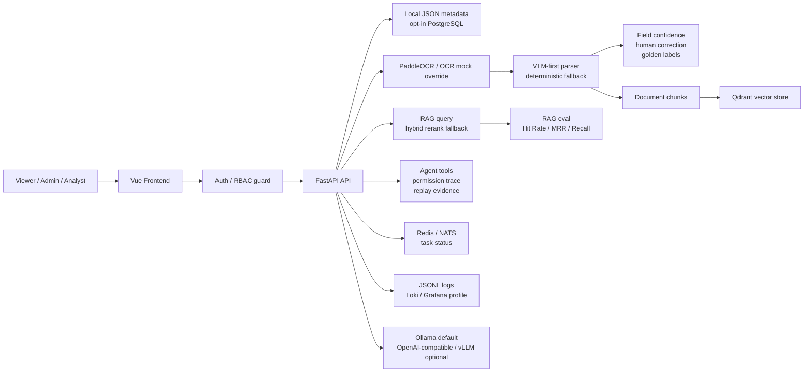

# System Design Walkthrough

這份 walkthrough 讓 DocuRAG 能在 10 分鐘內說清楚「文件如何進來、如何被解析、如何被查詢、如何被評估、如何被治理，以及哪些地方只是 demo-safe 不是 production-ready」。

## 10 Minute Talk Track

| Time | Focus | What to say |
|---|---|---|
| 0:00 - 1:00 | Product boundary | DocuRAG 分成 Viewer Chat 與 Admin Ingestion：Viewer 問已建立的知識庫，Admin / Analyst 才能上傳、OCR、parse、index 與測試 RAG。 |
| 1:00 - 2:30 | Document flow | 文件進來後先保存 metadata，再依來源走 image OCR、text upload、text-native PDF 或 scanned PDF page OCR path。 |
| 2:30 - 4:00 | OCR / VLM parser | PaddleOCR 產生 OCR lines；VLM-first parser 會帶 OCR context，欄位保留 confidence、source text、source page / bbox 與 fallback reason。 |
| 4:00 - 5:30 | RAG indexing / eval | Chunks 可進 Qdrant；RAG 查詢走 hybrid rerank fallback-safe path；eval 用 Hit Rate@K、MRR@K、Recall@K 比較策略。 |
| 5:30 - 6:45 | AgentOps | Agent 只使用 allowlisted read-only tools，trace 會顯示 planner fallback、tool permission、approval state 與 replay evidence。 |
| 6:45 - 8:00 | Platform pieces | PostgreSQL 是 opt-in metadata repository；Redis / NATS 是 demo-safe cache、rate-limit、worker skeleton 與 task status；observability 用 JSONL + Loki / Grafana local profile。 |
| 8:00 - 9:00 | Inference gateway | Ollama 是 local default；OpenAI-compatible / vLLM path 有 provider fallback、timeout guardrails、benchmark smoke 與 capacity planning report。 |
| 9:00 - 10:00 | Tradeoffs | 誠實說明 local JSON vs PostgreSQL、sync API vs worker、demo-safe vs production-ready，以及哪些 production gaps 不宣稱完成。 |

## Whiteboard Data Flow

## Runtime Surfaces

### Viewer Chat

- Viewer Chat only asks the existing knowledge base through `POST /rag/query`.
- It displays answer, answer source, retrieval source and citation summary.
- It does not expose upload, OCR, parse, vector index, eval run or Agent write operations.
- In demo / formal auth modes, backend guards also prevent Viewer from calling write APIs directly.

### Admin Ingestion

- Admin / Analyst can upload documents, run provider-selected OCR, trigger parser, run best-effort vector indexing, inspect structured fields and export golden labels.
- `.txt` files use `text_upload`; text-native PDFs use `pdf_text`; images use `image_ocr`; scanned / mixed PDFs can use page image OCR and `pdf_page_ocr` chunks.
- Manual mock OCR exists only as explicit fallback / validation path. It is not the default ingestion story.

### OCR / VLM Parser

- PaddleOCR is the default provider-selected OCR path when real OCR is configured.
- VLM-first parser uses image input plus compact OCR context when possible.
- Parser results keep `parser_source`, confidence, evidence state, source text, source page / bbox and fallback reason.
- Phase 44 adds a QA loop: humans can save corrections as golden labels, and parser field accuracy can compare parser output to those labels.

### RAG Indexing / Eval

- Chunks can be indexed into Qdrant with tenant / project / document / source payload filters.
- Query path favors `hybrid_rerank` in demo defaults, but falls back to keyword evidence when vector, embedding or rerank runtime is unavailable.
- Eval artifacts include built-in RAG eval, strategy comparison, retrieval regression report and chunking / indexing ablation report.
- Metrics are retrieval-focused: Hit Rate@K, MRR@K, Recall@K, latency, fallback count and failure count.

### AgentOps

- Agent uses controlled planning and allowlisted read-only tools such as document fields lookup and document search.
- Tool permission metadata records risk tier, approval requirement, approval state, side-effect policy and fallback reason.
- High-risk approval policy is fail-closed for future tools, but current allowlisted tools stay read-only.
- Agent replay is inspection-only: it validates saved evidence, not production autonomous execution.

### Redis / NATS Worker Path

- Redis is opt-in for session cache, RAG query cache and rate-limit slice.
- NATS supports memory worker skeleton and task status API for demo-safe async architecture.
- This explains the shape of background work, but does not execute production OCR / parser / indexing / eval jobs through a durable worker.

### PostgreSQL Metadata Path

- Local JSON is the default demo store because it keeps local validation simple.
- PostgreSQL repository mode is opt-in and has explicit migration from local JSON.
- The project demonstrates schema / repository boundaries without claiming production database operation.

### Inference Gateway

- Ollama remains the local default generation / VLM / embedding provider.
- OpenAI-compatible and vLLM paths are optional and skip-safe.
- Timeout guardrails keep generation from blocking the demo; unavailable providers return explicit fallback metadata.
- Capacity planning covers latency, tokens/sec, VRAM, KV cache estimate and GPU / NPU interpretation without promising production throughput.

### Observability

- API, RAG, eval and worker paths can emit structured JSONL trace logs.
- Local Loki / Promtail / Grafana profile documents dashboard evidence and query examples.
- This is enough to discuss observability data shape, not production alerting or incident response.

## Failure And Fallback Reading

| Failure | Expected fallback | How to explain it |
|---|---|---|
| PaddleOCR dependency unavailable | OCR endpoint returns actionable provider error; mock OCR remains explicit manual fallback | The system should fail visibly instead of silently pretending real OCR succeeded. |
| VLM parser unavailable / invalid output | Parser falls back to deterministic invoice parser and records fallback reason | Demo keeps moving while preserving evidence that the VLM path was unavailable. |
| Qdrant / embedding unavailable | RAG falls back to keyword evidence and records retrieval source | Retrieval quality may be lower, but citations remain grounded in local chunks. |
| Reranker unavailable | Hybrid candidates remain usable with rerank fallback reason | The eval / chat path does not collapse just because optional rerank is missing. |
| Ollama / vLLM unavailable | Answer generation falls back to retrieved chunks or writes skipped benchmark report | Inference ops evidence is skip-safe, not fake-success. |
| Viewer calls write API | Backend permission guard returns forbidden | Role boundary exists in backend, not only in frontend UI. |
| Worker runtime unavailable | Task status and smoke path show demo boundary | Async architecture is demonstrated without pretending durable production worker execution exists. |

## Main Tradeoffs

| Tradeoff | Current choice | Why it is acceptable for demo | Production-ready gap |
|---|---|---|---|
| Local JSON vs PostgreSQL | Local JSON default; PostgreSQL opt-in | Fast local validation, easy artifact inspection, no production DB needed | Backup, migrations, tenant isolation, transaction policy, operational runbook |
| Sync API vs worker | Core OCR / parser / indexing remain mostly synchronous demo paths; Redis / NATS shows worker boundary | Easier to validate ticket-by-ticket and reason about fallback behavior | Durable queue, retry, DLQ, idempotency, worker autoscaling |
| Demo-safe auth vs production identity | Demo login and formal signed bearer guard | Shows role behavior and backend permission checks without external identity provider | SSO, OAuth, MFA, refresh rotation, session revocation, audit retention |
| Optional local inference vs production gateway | Ollama default; vLLM / OpenAI-compatible optional and skip-safe | Lets local demo work without paid API key or GPU server | Load balancing, quota, circuit breaker, SLA, provider billing and secret management |
| Retrieval metrics vs answer quality eval | Hit Rate@K / MRR / Recall and trace metadata | Measures retrieval quality reproducibly with synthetic fixtures | LLM-as-judge, faithfulness, citation correctness, production eval history |
| Evidence artifacts vs production platform | JD evidence, reports, dashboards and smoke scripts | Interviewer can inspect files and rerun commands | Production alerting, multi-user analytics, managed dashboards, long-term storage |

## Interview Close

The strongest summary is:

> DocuRAG is not a production document AI platform yet. It is a validation-heavy portfolio system that shows the path from document ingestion to OCR / VLM parsing, RAG retrieval, eval metrics, Agent governance, inference fallback, and deployment / observability evidence, with every boundary labeled so the demo stays honest.
